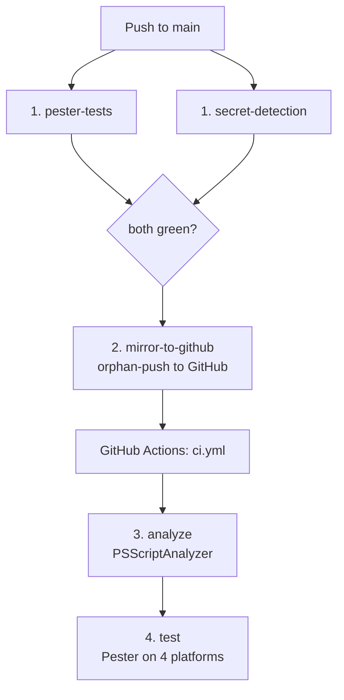
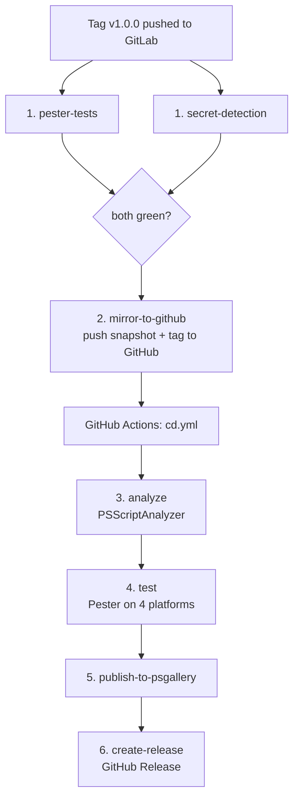

# Release Process

This document describes the exact steps required to release a new version of PSScriptBuilder.

## Step-by-Step Release Checklist

### 1. Determine the new version

Decide whether this is a **Major**, **Minor**, or **Patch** release according to [Semantic Versioning](https://semver.org):

| Type  | When to use                                      | Example         |
|-------|--------------------------------------------------|-----------------|
| Patch | Bug fixes, no new features, no breaking changes  | 1.0.0 -> 1.0.1  |
| Minor | New features, no breaking changes                | 1.0.0 -> 1.1.0  |
| Major | Breaking changes                                 | 1.0.0 -> 2.0.0  |

---

### 2. Update CHANGELOG.md

On the `development` branch, rename the `[Unreleased]` section to the new version with today's date:

```markdown
## [1.0.0] - 2026-04-14

### Added
- ...

### Fixed
- ...
```

Make sure all notable changes since the last release are listed under the correct categories
(`Added`, `Changed`, `Deprecated`, `Removed`, `Fixed`, `Security`).

Also check for any `*(available from x.y.z)*` markers in the documentation that match this
release version and remove them.

---

### 3. Update ReleaseNotes in the module manifest

On the `development` branch, review the `ReleaseNotes` field in `build/Output/PSScriptBuilder.psd1` and update it to reflect
the changes in this release. The `ReleaseNotes` are displayed on the PowerShell Gallery module page
and returned by `Find-PSResource`.

---

### 4. Commit and push to development

Commit all changes from steps 2 and 3 and push to `development`:

```powershell
git add .
git commit -m "Prepare release 1.0.0"
git push origin development
```

---

### 5. Merge development into main

Merge `development` into `main`. This can be done either via a GitLab Merge Request or directly on the command line:

```powershell
git checkout main
git pull origin main
git merge development -m "Merge branch 'development' into 'main'"
git push
```

Either way, wait for the GitLab pipeline on `main` to pass (including the mirror to GitHub) before continuing. Your working tree must be clean (`git status` shows "nothing to commit, working tree clean") before proceeding.

---

### 6. Bump the version, update metadata, and rebuild the module

Run the appropriate Release build command from the project root:

```powershell
# For a Patch release
.\Build-Module.ps1 -Release -Patch

# For a Minor release
.\Build-Module.ps1 -Release -Minor

# For a Major release
.\Build-Module.ps1 -Release -Major
```

This performs all of the following in one step:

1. Bumps the version in `build/Release/psscriptbuilder.releasedata.json`
2. Updates build metadata (date, time, build number) and Git metadata (branch, commit hash)
3. Applies the new version to all files configured in `build/Release/psscriptbuilder.bumpconfig.json`
   (e.g. `ModuleVersion` in `PSScriptBuilder.psd1`)
4. Rebuilds `build/Output/PSScriptBuilder.psm1` from source via the template pipeline

**Note:** `-UpdateGitDetails` captures the commit hash of the last commit before the release commit,
not the release commit itself (which does not exist yet at this point). This is an unavoidable
sequencing constraint. The Git tag `v<Major>.<Minor>.<Patch>` remains the authoritative reference for the release.

---

### 7. Validate the module manifest

Before committing, verify that the module manifest is structurally valid:

```powershell
Test-ModuleManifest .\build\Output\PSScriptBuilder.psd1
```

This confirms that all required fields are present and the manifest can be parsed correctly.
Fix any reported issues before proceeding.

---

### 8. Commit and tag

Replace `1.0.0` with the actual version number:

```powershell
git add .
git commit -m "Release 1.0.0"
git tag -a v1.0.0 -m "Release 1.0.0"
```

Use an annotated tag (`-a`) — it carries tagger identity, date, and message, and is required for `--follow-tags` in the next step. The tag must follow the pattern `v<Major>.<Minor>.<Patch>` (e.g. `v1.0.0`) to trigger the CI/CD pipeline.

---

### 9. Push to GitLab

```powershell
git push --follow-tags
```

Pushes `main` and all reachable annotated tags in a single transaction, avoiding race conditions between parallel GitLab pipelines. Pushing the tag triggers the full release pipeline automatically.

---

## What happens automatically

### After a push to main

Every push to `main` triggers the GitLab CI pipeline. Once `pester-tests` and `secret_detection` pass, `mirror-to-github` checks whether a version tag exists on HEAD. If no tag is present, it pushes the current state as an orphan snapshot to GitHub. That push event triggers `ci.yml` on GitHub, which runs PSScriptAnalyzer followed by the Pester test suite on all 4 platforms (PS5.1, PS7 on Windows, Linux, macOS).

**On a release push (`git push --follow-tags`)**, the branch pipeline runs in parallel with the tag pipeline (see below). The branch pipeline's `mirror-to-github` job detects the version tag on HEAD and exits immediately with success (`exit 0`), deferring all GitHub writes to the tag pipeline. This prevents a race condition where both pipelines would otherwise force-push to GitHub `main`.



### After pushing the tag

The tag push triggers a second GitLab CI pipeline in parallel with the branch pipeline. Once `pester-tests` and `secret_detection` pass, `mirror-to-github` pushes the release snapshot and the tag to GitHub, which triggers `cd.yml`. The branch pipeline's `mirror-to-github` defers to this pipeline (see above).



If any stage fails, all subsequent stages are blocked:

- `pester-tests` or `secret-detection` (GitLab) fails → mirror does not run, no GitHub Actions triggered
- `analyze` job fails → `test`, `publish-to-psgallery`, and `create-release` jobs are blocked
- `test` job fails → `publish-to-psgallery` and `create-release` jobs are blocked
- `publish-to-psgallery` job fails → GitHub Release is not created

---

## After the release

### 1. Prepare CHANGELOG.md for the next iteration

On `main`, add a new empty `[Unreleased]` section at the top of `CHANGELOG.md`:

```markdown
## [Unreleased]

## [1.0.0] - YYYY-MM-DD
...
```

Commit and push to `main`:

```powershell
git add CHANGELOG.md
git commit -m "Prepare next development iteration"
git push origin main
```

### 2. Back-merge main into development

The release commit and the "Prepare next development iteration" commit exist on `main`
but not yet on `development`. The back-merge brings `development` to the same base as `main`,
which keeps the branch status in GitLab clean ("0 commits behind") and ensures that the release
files (`CHANGELOG.md`, `psscriptbuilder.releasedata.json`, `PSScriptBuilder.psd1`) are in sync
on both branches before new feature development begins.

Immediately after the release, merge `main` back into `development`:

```powershell
git checkout development
git merge main -m "Merge branch 'main' into development"
git push origin development
```

After the merge, verify that `CHANGELOG.md` contains exactly one `[Unreleased]` section at the top and no duplicate version entries.

Only after this back-merge should new feature development begin on `development`.

---

## Troubleshooting

### Pipeline job fails after release commit — Fix requires tag recreation

If a pipeline failure is discovered after the release commit and tag have been pushed, the fix requires pushing a new commit to `main`. After pushing the fix, the tag must be moved to the new commit:

> **Do not use "Re-run all jobs" in GitHub Actions.** GitHub Actions re-runs use the original checkout SHA of the tag, not the latest commit on `main`. The fix commit is not included.

**Correct procedure:**

1. Push the fix commit to `main`
2. Delete the tag from GitLab (**Web UI only** — see below)
3. Delete the tag locally: `git tag -d v1.0.0`
4. Recreate the tag on the new commit: `git tag -a v1.0.0 -m "Release 1.0.0"`
5. Push again: `git push --follow-tags`

### Protected tags cannot be deleted via CLI

GitLab tags matching a protected pattern (e.g. `v*`) are rejected when deleted via `git push --delete` or `git push origin :v1.0.0`.

**Delete via Web UI:** GitLab → Repository → Tags → find the tag → delete button.
