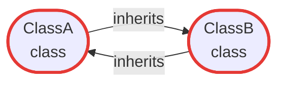
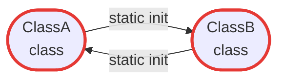
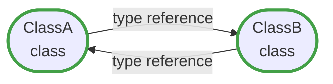

# Dependency Analysis

PSScriptBuilder uses PowerShell AST analysis to build a dependency graph of all collected
components and determine the correct load order for the generated output script. This ensures
that base classes always appear before derived classes, and that interdependent components are
placed in the right sequence — automatically, without any manual ordering.

The dependency graph is a directed graph where each node represents a component (class,
function, or enum) and each edge represents a dependency. An edge from `Employee` to `Person` means:
`Employee` depends on `Person`, so `Person` must appear first. Built-in types (`string`, `int`,
`bool`, `System.*`, etc.) are automatically excluded — only types that are part of the project
create graph edges.

When a collector processes a source file, the AST engine extracts the following dependency
information per component:

| Component | Dependencies extracted |
|---|---|
| Class | `BaseClass`, `TypeReferences` (properties, method parameters), `StaticInitializerReferences`, `CalledFunctions` |
| Function | `CalledFunctions`, `TypeReferences` |
| Enum | None — enums have no outgoing dependencies and always appear first |

If your build fails with a cycle error, see [Circular Dependencies](#circular-dependencies).
If PSScriptBuilder switches to Ordered Mode unexpectedly, see [Cross-Dependencies](#cross-dependencies).
For a practical walkthrough and examples, jump to [Walkthrough](#walkthrough).

## Circular Dependencies

PSScriptBuilder distinguishes two types of circular dependencies: fatal cycles and type reference
cycles. Understanding the difference is important — one prevents the build entirely, the other is
handled automatically.

### Fatal cycles

A cycle is fatal when it creates an unresolvable ordering constraint at PowerShell load time.
PowerShell processes a script file from top to bottom: before any code runs, it works through all
type definitions in order. A class must appear in the file after the types it depends on — otherwise,
PowerShell cannot resolve the type at load time and the script fails immediately with a type-not-found
error.

Two dependency types create this ordering constraint:

**Inheritance** — when class A inherits from class B, class B must already be defined at the point
where class A is loaded. If two classes inherit from each other — directly or through a chain —
there is no valid top-to-bottom order that satisfies both requirements at the same time.

A direct cycle involves just two classes:

```powershell title="Direct inheritance cycle"
class ClassA : ClassB { }  # ClassA requires ClassB to be defined first
class ClassB : ClassA { }  # ClassB requires ClassA to be defined first — impossible
```



A chain cycle can span any number of classes — the result is the same:

```powershell title="Chain inheritance cycle"
class ClassA : ClassB { }  # ClassA requires ClassB
class ClassB : ClassC { }  # ClassB requires ClassC
class ClassC : ClassA { }  # ClassC requires ClassA — cycle: A → B → C → A
```


**Static property initializers** — when PowerShell reads a class definition, it immediately runs
any static property initializer expressions. A static initializer is therefore not just a
declaration — it is code that executes at load time. Any type referenced in the initializer must
already be defined at that point — the same hard requirement as inheritance.

```powershell title="Mutual static initializer cycle"
class ClassA {
    static [ClassB] $Default = [ClassB]::new()  # [ClassB]::new() runs when ClassA loads
}

class ClassB {
    static [ClassA] $Default = [ClassA]::new()  # [ClassA]::new() runs when ClassB loads
}
```



If ClassA has a static initializer that references ClassB, and ClassB has a static initializer
that references ClassA, neither can be loaded first. This is just as fatal as a direct inheritance
cycle, and PSScriptBuilder treats it accordingly.

PSScriptBuilder detects both cycle types before attempting to sort and fails immediately with a
clear error that names all components involved. The error must be resolved in the source code —
there is no workaround.

### Type reference cycles

A type reference cycle occurs when two classes reference each other inside method bodies. At first
glance this looks like the same problem — but it is fundamentally different. Method bodies are not
executed when the class is loaded; they only run when the method is called. By the time any method
is called, all class definitions in the module have already been loaded and are available. So it
does not matter in which order the classes appear in the file.

```powershell title="Mutual type reference cycle"
class ClassA {
    [void] Run() {
        $b = [ClassB]::new()  # only executed when Run() is called, not on load
    }
}

class ClassB {
    [void] Run() {
        $a = [ClassA]::new()  # only executed when Run() is called, not on load
    }
}
```



Whether `ClassA` or `ClassB` appears first in the file makes no difference here. PowerShell
parses all class definitions in the output script together, so both types are known before any
method body is ever invoked.

PSScriptBuilder detects and resolves these cycles automatically. No build failure occurs and no
changes to the source code are required.

## Cross-Dependencies

Cross-dependencies arise when classes and functions must be interleaved in the output.
PSScriptBuilder detects this condition automatically — see below for when and why this
happens, and the [Templates Guide](templates.md#4-ordered-mode-and-hybrid-mode) for the required
template changes.

### Free Mode, Hybrid Mode, and Ordered Mode

Understanding when and why the mode switch happens is important for designing your project
structure.

**Free Mode** applies when all enums, classes, and functions can be cleanly separated in the
output — all enums first, then all classes in dependency order, then all functions. Each
collector maps to its own placeholder in the template; inter-collector ordering is controlled
by the position of those placeholders in the template.

**Ordered Mode** applies when the global dependency graph requires classes and functions
to be interleaved in the output — meaning it is not possible to output all classes as a single
block followed by all functions. PSScriptBuilder detects this automatically: after all components
are sorted in dependency order, any function that must appear before a class signals that
interleaving is required.

When this condition is detected, the template must be adapted — see the
[Templates Guide](templates.md#4-ordered-mode-and-hybrid-mode) for the required template structure.

**Hybrid Mode** applies when the template already contains the ordered-components placeholder
but `HasCrossDependencies` is `false`. This is an opt-in configuration for projects that
anticipate future cross-dependencies, or that simply prefer a single unified component block
regardless of the actual dependency structure. PSScriptBuilder handles Hybrid Mode and Ordered
Mode identically at validation and render time.

**Practical implication:** Whether Ordered Mode is triggered depends on the actual dependency
relationships between your classes and functions — not on how they are organized across
collectors or directories. Use `Get-PSScriptBuilderDependencyAnalysis` to check whether
cross-dependencies exist before designing your template. If they do, replace all per-type
placeholders for enums, classes, and functions with a single ordered-components placeholder
(default: `{{ORDERED_COMPONENTS}}`). Alternatively, use Hybrid Mode to adopt this layout
proactively, even when no cross-dependencies currently exist.

### Factory functions and cross-dependencies

A common source of unexpected cross-dependencies is a function that calls another function
which in turn depends on a class in the inheritance graph. Consider this scenario:


`Write-Log` depends on `LoggerBase` and on `New-LogEntry`. `New-LogEntry` depends on `LogEntry`.
The topological sort must place `New-LogEntry` after `LogEntry` but before `ConsoleLogger` and
`FileLogger` — which means a function has to appear between class definitions.
PSScriptBuilder detects the Function→Class transition and activates Ordered Mode.

The class hierarchy itself has no cycles and no direct class–function interleaving. The
cross-dependency is introduced entirely by the `Write-Log → New-LogEntry` call chain.

Replacing the factory call with a direct constructor call removes the function-to-function
dependency:

```powershell title="Factory call — PSScriptBuilder detects a cross-dependency"
Function Write-Log {
    param([LoggerBase] $Logger, [LogLevel] $Level, [string] $Message)
    $entry = New-LogEntry -Level $Level -Message $Message
    $Logger.Log($entry)
}
```

```powershell title="Direct constructor — no cross-dependency"
Function Write-Log {
    param([LoggerBase] $Logger, [LogLevel] $Level, [string] $Message)
    $entry = [LogEntry]::new($Level, $Message)
    $Logger.Log($entry)
}
```

With the direct constructor, no function depends on another function. The topological sort
places all classes first, then all functions, and PSScriptBuilder stays in Free Mode.

This is not a limitation — PSScriptBuilder correctly analyses what is actually in the code.
A factory call creates a real dependency, and PSScriptBuilder responds by choosing the mode
that guarantees a valid output. The choice between `[ClassName]::new(...)` and a factory
function is a design decision with consequences for the build mode.

| Situation | Recommendation |
|-----------|----------------|
| Project already uses `{{ORDERED_COMPONENTS}}` | Factory functions are fine — cross-dependencies are handled |
| Project uses per-type or per-layer placeholders | Prefer direct constructors to avoid unintentional cross-dependencies |
| Factory function contains logic beyond construction | Use it and accept Ordered Mode, or move the logic into the class constructor |

See [Example 10](../examples.md#10-multiple-collectors) for a complete project that
illustrates this behaviour.

## Cross-Collector Dependencies

PSScriptBuilder resolves all dependencies — inheritance, static initializers, and type references — across the full set of collectors combined. Within a single template placeholder, components are always output in the correct dependency order.

However, when components in **different collectors** depend on each other, the order of the template placeholders becomes critical. This applies equally to classes and functions:

- A class that inherits from a class in another collector requires that collector's placeholder to appear first in the template
- A function whose parameters reference a type from another collector requires the class collector's placeholder to appear first

PSScriptBuilder sorts components correctly within each placeholder block — but it cannot reorder placeholders in your template.

Consider two collectors where `DerivedClass` inherits from `BaseClass`, and `My-Function` has a parameter of type `BaseClass`:

```powershell
$contentCollector = New-PSScriptBuilderContentCollector |
    Add-PSScriptBuilderCollector -Type Class    -CollectionKey "CORE_CLASSES"   -IncludePath "src\Core"      | # contains BaseClass
    Add-PSScriptBuilderCollector -Type Class    -CollectionKey "DOMAIN_CLASSES" -IncludePath "src\Domain"    | # contains DerivedClass : BaseClass
    Add-PSScriptBuilderCollector -Type Function -CollectionKey "MY_FUNCTIONS"   -IncludePath "src\Functions"  # contains My-Function([BaseClass] $obj)
```

The template **must** respect the dependency order across all three placeholders:

```powershell title="Correct template order"
{{CORE_CLASSES}}    # BaseClass defined here
{{DOMAIN_CLASSES}}  # DerivedClass : BaseClass — valid, BaseClass already loaded
{{MY_FUNCTIONS}}    # My-Function([BaseClass] $obj) — valid, BaseClass already loaded
```

```powershell title="Incorrect template order — generates invalid script"
{{MY_FUNCTIONS}}    # My-Function([BaseClass] $obj) — BaseClass not yet defined!
{{DOMAIN_CLASSES}}  # DerivedClass : BaseClass — BaseClass not yet defined!
{{CORE_CLASSES}}    # BaseClass is defined here, but too late
```

The wrong order produces an invalid script. By default, PSScriptBuilder parses the output
after writing it — the build will fail with a syntax validation error before the script is
ever used. If `-SkipSyntaxValidation` is set, the invalid script is written to disk and
will fail at load time with a `type-not-found` error. To help prevent this, PSScriptBuilder
emits a build warning for every cross-collector dependency it detects, naming the affected
components and the template placeholder order required.

### Reducing Cross-Collector Dependencies

The simplest way to avoid this problem is to consolidate related components into a single
collector. Instead of splitting base classes and derived classes across two class collectors,
use one collector that contains all of them — PSScriptBuilder will order them automatically.
The same applies to functions: if interdependent functions share a single function collector,
no cross-collector ordering is required.

When components of **different types** depend on each other — for example, a function that
uses a class — consolidation is not possible, since classes and functions require separate
collectors. In this case, ensure that the class collector placeholder appears **before** the
function collector placeholder in the template.

Note that this only applies to **Free Mode**:
in Ordered and Hybrid Mode, the `{{ORDERED_COMPONENTS}}` placeholder (or your configured key)
handles the global ordering automatically.

## Topological Sort

The sort uses **Kahn's algorithm** and gives the following guarantees:

- Every prerequisite always appears before its dependents
- Enums are always placed first (they have no dependencies)

!!! note
    The relative order of independent components — those with no ordering constraint between
    them — may vary between runs. Kahn's algorithm processes components level by level. Within
    a level, all components are equally valid candidates. Their sequence within that level
    depends on the internal graph traversal order, which is not guaranteed to be stable.

The following example illustrates the guaranteed load order for a simple inheritance chain:


| Load order | Component | Reason |
|---|---|---|
| 1 | `Person` | No dependencies |
| 2 | `Employee` | Inherits from `Person` |
| 3 | `Manager` | Inherits from `Employee` |

---

## Walkthrough

### 1. Run a Dependency Analysis

[`Get-PSScriptBuilderDependencyAnalysis`](../cmdlets/Get-PSScriptBuilderDependencyAnalysis.md)
runs the full dependency analysis pipeline — collection, graph building, cycle detection, and
topological sort — and returns a result object with all findings. It does not produce any
output file. Use it to inspect the dependency structure of your project without performing a
build.

```powershell
$contentCollector = New-PSScriptBuilderContentCollector |
    Add-PSScriptBuilderCollector -Type Class    -IncludePath "src\Classes" |
    Add-PSScriptBuilderCollector -Type Function -IncludePath "src\Public"

$analysis = Get-PSScriptBuilderDependencyAnalysis -ContentCollector $contentCollector
```

Add `-Verbose` to see detailed output during collection and graph construction.

### 2. Inspect the Ordered Components

The `OrderedComponents` property contains all component names in the order they will appear
in the output script. This is the final result of the topological sort — the sequence that
guarantees every prerequisite appears before its dependents:

```powershell
Write-Host "Load order:"
$analysis.OrderedComponents | ForEach-Object { Write-Host "  - $_" }
```

If `HasCycles` is `true`, `OrderedComponents` is empty — sorting is not possible when an
Inheritance cycle exists. Type reference cycles are resolved automatically and do not set
`HasCycles`.

### 3. Check for Circular Dependencies

Before using the analysis result, always check whether a cycle was detected. The `HasCycles`
property indicates a problem; `CyclePath` names all components involved, with the first
component repeated at the end to show the closed loop:

```powershell
if ($analysis.HasCycles) {
    Write-Error "Circular dependency detected: $($analysis.CyclePath -join ' -> ')"
    return
}
```

Example cycle path output:

```text
ServiceA -> ServiceB -> ServiceC -> ServiceA
```

Fatal cycles — Inheritance and StaticInitializer — cause the build to fail immediately. Type
reference cycles are resolved automatically by PSScriptBuilder and do not appear in `CyclePath`.
Fatal cycles must be resolved in the source code before PSScriptBuilder can produce a valid output
script.

### 4. Check for Cross-Dependencies

When classes and functions are interleaved in the topological order, cross-dependencies exist
and the template must use the configured ordered-components placeholder
(default: `{{ORDERED_COMPONENTS}}`) instead of separate per-type placeholders.
The `HasCrossDependencies` property reports this condition:

```powershell
if ($analysis.HasCrossDependencies) {
    Write-Host "Cross-dependencies detected — template must use the ordered components placeholder"
} else {
    Write-Host "Free mode — separate per-type placeholders work fine"
}
```

`HasCrossDependencies` is always `false` when `HasCycles` is `true`, since no sort is
performed in that case.

### 5. Inspect the Dependency Graph

The `DependencyGraph` property provides direct low-level access to all graph nodes and edges.
For typical scenarios, use `Get-PSScriptBuilderComponentDependency` instead — see
[Querying the Dependency Graph](#querying-the-dependency-graph).

When querying the graph directly, assign it to a local variable first to keep subsequent calls
concise:

```powershell
$graph = $analysis.DependencyGraph
```

**Forward direction** — what does a component depend on?

```powershell title="Forward: what does ClassA depend on?"
$prerequisites = $graph.GetDependencies("ClassA")
Write-Host "ClassA depends on: $($prerequisites -join ', ')"
```

**Filtered by edge type** — isolate inheritance relationships:

```powershell title="Filtered: which classes does ClassA inherit from?"
$bases = $graph.GetDependencies("ClassA", [PSScriptBuilderDependencyEdgeType]::Inheritance)
Write-Host "ClassA inherits from: $($bases -join ', ')"
```

**Reverse direction** — what would be affected by a change?

```powershell title="Reverse (impact): what depends on BaseClass?"
$dependents = $graph.GetDependents("BaseClass")
Write-Host "Changing BaseClass affects: $($dependents -join ', ')"
```

For all available methods and edge types, see [Dependency Graph Methods](#dependency-graph-methods)
in the Reference section.

### 6. Component Statistics

The `ComponentCounts` property provides a per-type breakdown of all collected components.
The `TotalComponents`, `TotalNodes`, and `TotalEdges` properties give a quick overview of the
size and complexity of the dependency graph:

```powershell
$counts = $analysis.ComponentCounts

Write-Host "Using statements: $($counts.UsingStatements)"
Write-Host "Enums:            $($counts.EnumDefinitions)"
Write-Host "Classes:          $($counts.ClassDefinitions)"
Write-Host "Functions:        $($counts.FunctionDefinitions)"
Write-Host "Files:            $($counts.FileContents)"
Write-Host "Total components: $($analysis.TotalComponents)"
Write-Host "Graph nodes:      $($analysis.TotalNodes)"
Write-Host "Graph edges:      $($analysis.TotalEdges)"
```

`TotalNodes` counts all components that participate in at least one dependency relationship —
either as a dependent or as a prerequisite. A base class like `Person` with no outgoing
dependencies is still counted as a node if another component depends on it.
`TotalEdges` counts the number of dependency relationships between components.

### 7. Pre-Build Validation Pattern

Combining dependency analysis with a build call into a single script is the recommended
pattern for automated builds. Check for cycles first, report cross-dependencies if present,
then proceed with the build:

```powershell
$contentCollector = New-PSScriptBuilderContentCollector |
    Add-PSScriptBuilderCollector -Type Class    -IncludePath "src\Classes" |
    Add-PSScriptBuilderCollector -Type Function -IncludePath "src\Public"

$analysis = Get-PSScriptBuilderDependencyAnalysis -ContentCollector $contentCollector

if ($analysis.HasCycles) {
    Write-Error "Build aborted — circular dependency: $($analysis.CyclePath -join ' -> ')"
    return
}

if ($analysis.HasCrossDependencies) {
    Write-Warning "Cross-dependencies detected — ensure template uses {{ORDERED_COMPONENTS}}"
}

Invoke-PSScriptBuilderBuild -ContentCollector $contentCollector `
    -TemplatePath 'build\Templates\MyProject.ps1.template' `
    -OutputPath   'build\Output\MyProject.ps1'
```

Note that `Invoke-PSScriptBuilderBuild` runs its own internal dependency analysis and will
also fail on cycles. The explicit pre-check is optional but recommended — it gives you the
full `CyclePath` details and allows you to handle the error gracefully before the build starts.

---

## Querying the Dependency Graph

`Get-PSScriptBuilderDependencyAnalysis` returns the full analysis result — ordered components,
cycle information, cross-dependency detection, and the raw dependency graph. But the result
object also serves as the entry point for interactive exploration. Three cmdlets build on it
to answer the questions that naturally arise when working with a non-trivial codebase:

| Cmdlet | Purpose |
|---|---|
| `Get-PSScriptBuilderComponentDependency` | Breadth-first traversal from a named component. Returns all reachable components with their depth and full dependency path. Supports forward (dependencies) and reverse (dependents) traversal, with optional edge-type filtering. |
| `ConvertTo-PSScriptBuilderComponentDependencyTree` | Converts the output of `Get-PSScriptBuilderComponentDependency` to a Unicode tree diagram. Returns a string suitable for display, file output, or documentation. |
| `Export-PSScriptBuilderDependencyGraph` | Exports the full graph — all components and edges — as a Mermaid Markdown file or a Graphviz DOT file. |

**When to use which:**

- Use [`Get-PSScriptBuilderComponentDependency`](../cmdlets/Get-PSScriptBuilderComponentDependency.md) when you need to reason about a *specific* component — its prerequisites, its dependents, or its position in the hierarchy.
- Add [`ConvertTo-PSScriptBuilderComponentDependencyTree`](../cmdlets/ConvertTo-PSScriptBuilderComponentDependencyTree.md) to visualise the result as a readable tree, or to capture it as a string for documentation.
- Use [`Export-PSScriptBuilderDependencyGraph`](../cmdlets/Export-PSScriptBuilderDependencyGraph.md) when you need an overview of the *entire* project structure — for architecture reviews, onboarding, or CI-generated documentation.

The three cmdlets compose naturally in a pipeline:

```powershell
$contentCollector = New-PSScriptBuilderContentCollector |
    Add-PSScriptBuilderCollector -Type Class    -IncludePath "src\Classes" |
    Add-PSScriptBuilderCollector -Type Function -IncludePath "src\Public"

$analysis = Get-PSScriptBuilderDependencyAnalysis -ContentCollector $contentCollector

# Render the dependency tree for a single component
$analysis | Get-PSScriptBuilderComponentDependency -Name 'New-Employee' |
    ConvertTo-PSScriptBuilderComponentDependencyTree

# Export the full graph as a Mermaid diagram
$analysis | Export-PSScriptBuilderDependencyGraph -OutputPath '.\docs\architecture.md' -Force
```

---

## Advanced Use Cases

The following use cases show how the three query cmdlets work together in practice. They cover
the scenarios that come up most often when working with a real project: understanding load order,
assessing the impact of a change, detecting structural problems, and generating documentation.

The use cases are split into two groups. The first group uses
[Example 06 — Hybrid Mode](../examples.md#06-hybrid-mode) — a small HRM project with short,
readable component names and concrete, predictable output. The second group uses PSScriptBuilder
itself — a real project with over 110 components — to demonstrate scenarios where scale matters.

### Querying Individual Components

The following use cases use [`Get-PSScriptBuilderComponentDependency`](../cmdlets/Get-PSScriptBuilderComponentDependency.md) and
[`ConvertTo-PSScriptBuilderComponentDependencyTree`](../cmdlets/ConvertTo-PSScriptBuilderComponentDependencyTree.md) to answer questions about specific components.

!!! note "Setup — Example 06"
    All examples in this group use [Example 06 — Hybrid Mode](../examples.md#06-hybrid-mode):
    two enums (`Department`, `EmploymentStatus`), three classes (`Person`, `Address`, `Employee`),
    and three functions (`Get-EmployeesByDepartment`, `New-Employee`, `Set-EmployeeStatus`).
    `Employee` inherits from `Person` and has type references to `Address`, `Department`, and
    `EmploymentStatus`. The functions reference `Employee` and the enums as parameter types.

    Run the following from the `examples\06-hybrid-mode` directory:

    ```powershell
    $contentCollector = New-PSScriptBuilderContentCollector |
        Add-PSScriptBuilderCollector -Type Enum     -IncludePath "src\Enums"     |
        Add-PSScriptBuilderCollector -Type Class    -IncludePath "src\Classes"   |
        Add-PSScriptBuilderCollector -Type Function -IncludePath "src\Functions"

    $analysis = Get-PSScriptBuilderDependencyAnalysis -ContentCollector $contentCollector
    ```

#### Load-Order Understanding

When a class appears unexpectedly early or late in the output script, or when you want to
understand why a newly added component ended up at a specific position, it helps to see
exactly which prerequisites it brings with it.

```powershell
$analysis | Get-PSScriptBuilderComponentDependency -Name 'New-Employee'
```

The default direction is `Dependencies` — the traversal follows outgoing edges and returns all
components that `New-Employee` directly or transitively depends on. Each result entry carries
a `Name`, a `Depth` (1 = direct dependency, 2+ = transitive), and a `DependencyPath` — the full path
from the starting component to this dependency. See [Component Dependency Entry](#component-dependency-entry)
in the Reference section for all properties.

Output:

```
Name              Depth  DependencyPath
----              -----  --------------
Address               1  {New-Employee, Address}
Department            1  {New-Employee, Department}
Employee              1  {New-Employee, Employee}
EmploymentStatus      2  {New-Employee, Employee, EmploymentStatus}
Person                2  {New-Employee, Employee, Person}
```

`Address`, `Department`, and `Employee` are at depth 1 — `New-Employee` references them
directly as parameter types. `EmploymentStatus` and `Person` are at depth 2: the
`DependencyPath` shows exactly how they are reached — `New-Employee → Employee → EmploymentStatus`
and `New-Employee → Employee → Person`. They are not referenced by `New-Employee` directly, but
`Employee` depends on them, so they must be loaded before `Employee` can be defined. The path
explains not just *what* must appear first in the output script, but *why*.

#### Impact Analysis Before a Refactoring

Before modifying a shared base class, identify all components that would be affected.
Without this information, a seemingly small change to a base class can break derived
classes in unexpected ways — especially in larger projects where the full inheritance
tree is not visible at a glance.

```powershell
$analysis | Get-PSScriptBuilderComponentDependency -Name 'Person' -Direction Dependents
```

Using `-Direction Dependents` reverses the traversal direction: instead of asking *what does
this component need*, it asks *what needs this component*. The result lists every component that
directly or transitively depends on `Person` — giving you the full scope of the change
before touching a single line of code. A long result list is a signal to proceed carefully;
a short one confirms that the impact is contained.

Output:

```
Name                       Depth  DependencyPath
----                       -----  --------------
Employee                       1  {Person, Employee}
Get-EmployeesByDepartment      2  {Person, Employee, Get-EmployeesByDepartment}
New-Employee                   2  {Person, Employee, New-Employee}
Set-EmployeeStatus             2  {Person, Employee, Set-EmployeeStatus}
```

`Employee` directly inherits from `Person` (depth 1). All three functions depend on `Employee`
as a parameter type — so they are indirectly affected as well (depth 2). The `DependencyPath`
confirms the route: each function is reached via `Person → Employee → <function>`.

#### Visual Dependency Chain

Reading a flat list of dependency entries is functional, but a tree diagram is much easier
to reason about — especially when the same component is reachable via multiple paths.
`ConvertTo-PSScriptBuilderComponentDependencyTree` takes the output of
`Get-PSScriptBuilderComponentDependency` and renders it as an indented ASCII tree that shows
the full path from the root to each dependency:

```powershell
$analysis | Get-PSScriptBuilderComponentDependency -Name 'New-Employee' |
    ConvertTo-PSScriptBuilderComponentDependencyTree
```

Output:

```
New-Employee
├── Address
├── Department
└── Employee
    ├── EmploymentStatus
    └── Person
```

`Address` and `Department` appear at the top level because `New-Employee` references them
directly as parameter types. `Employee` appears at the same level and brings its own
prerequisites — `EmploymentStatus` and `Person` — as children.

#### Embed Dependency Tree in Documentation

The tree is written directly to the host by default. To capture it as a string and write it
into a Markdown file — for example to keep documentation in sync with the source automatically
— assign the output to a variable and embed it in a here-string:

```powershell
$tree = $analysis | Get-PSScriptBuilderComponentDependency -Name 'New-Employee' |
    ConvertTo-PSScriptBuilderComponentDependencyTree

$content = @"
## Dependencies

``````text
$tree
``````
"@

Set-Content -Path '.\docs\architecture.md' -Value $content
```

The resulting file contains:

~~~markdown
## Dependencies

```text
New-Employee
├── Address
├── Department
└── Employee
    ├── EmploymentStatus
    └── Person
```
~~~

Run this as part of your build script to keep the documentation in sync with the source
automatically — no manual updates required.

#### Inheritance Hierarchy

When a project uses a strategy pattern, a plugin architecture, or any design based on
abstraction, understanding the full inheritance tree is essential — both for new team members
and for reviewing the structure during a refactoring. This use case discovers all base classes
automatically (any class that has at least one subclass) and renders their full hierarchy.

The key here is `-EdgeType Inheritance`, which restricts the BFS traversal to inheritance edges
only. Without it, the tree would also include classes that merely reference the base class as
a parameter type — which would make the output noisy and misleading.

```powershell
$baseClasses = $analysis.DependencyGraph.GetAllNodes() | Where-Object {
    ($analysis | Get-PSScriptBuilderComponentDependency -Name $_ -Direction Dependents -EdgeType Inheritance).Count -gt 0
}

foreach ($baseClass in ($baseClasses | Sort-Object)) {
    $analysis | Get-PSScriptBuilderComponentDependency -Name $baseClass -Direction Dependents -EdgeType Inheritance |
        ConvertTo-PSScriptBuilderComponentDependencyTree
    Write-Host
}
```

Output:

```
Person
└── Employee
```

In this example, `Person` is the only base class — `Employee` inherits from it. `Address`,
`Department`, and `EmploymentStatus` have no subclasses and therefore do not appear. In a
larger project with multiple inheritance chains, each base class would produce its own tree
block, printed one after the other.

---

### Working with Larger Projects

The following use cases use `Get-PSScriptBuilderComponentDependency` and
[`Export-PSScriptBuilderDependencyGraph`](../cmdlets/Export-PSScriptBuilderDependencyGraph.md)
to answer questions that only become relevant at scale — structural quality, architecture
overview, and keeping documentation in sync with the source. The examples use PSScriptBuilder
itself as the target project.

!!! note "Setup — PSScriptBuilder"
    All examples in this group assume `$analysis` is populated from PSScriptBuilder's own
    source tree:
    ```powershell
    $contentCollector = New-PSScriptBuilderContentCollector |
        Add-PSScriptBuilderCollector -Type Enum     -IncludePath "src\Enums"   |
        Add-PSScriptBuilderCollector -Type Class    -IncludePath "src\Classes" |
        Add-PSScriptBuilderCollector -Type Function -IncludePath "src\Public"

    $analysis = Get-PSScriptBuilderDependencyAnalysis -ContentCollector $contentCollector
    ```

#### God-Class Detection

A *God Class* is a component that knows about — and therefore depends on — too many other
components. It tends to grow over time, becomes hard to test in isolation, and creates a
bottleneck for refactoring. Transitive dependency count is a practical proxy for this smell:
the more components a class depends on, the more it knows.

This use case works best on a larger project:

```powershell
$analysis.DependencyGraph.GetAllNodes() | ForEach-Object {
    $deps = $analysis | Get-PSScriptBuilderComponentDependency -Name $_
    [PSCustomObject]@{ Name = $_; Count = $deps.Count }
} | Sort-Object Count -Descending | Select-Object -First 10
```

Output:

```
Name                                Count
----                                -----
Watch-PSScriptBuilderProject           43
PSScriptBuilderProjectWatcher          42
Invoke-PSScriptBuilderBuild            39
PSScriptBuilderBuildOrchestrator       38
Get-PSScriptBuilderTemplateAnalysis    35
PSScriptBuilderTemplateAnalyzer        34
New-PSScriptBuilderTemplate            33
Find-PSScriptBuilderUnusedComponent    33
Test-PSScriptBuilderTemplate           32
PSScriptBuilderTemplateGenerator       32
```

`Watch-PSScriptBuilderProject` sits at the top with 43 transitive dependencies — as the top-level
entry point for watch mode, it orchestrates the entire watch and build pipeline and therefore pulls
in nearly half the module. This is expected for a top-level entry point. Use the result as a starting point for a structural review — not every
high-count component is a problem, but components that score significantly higher than their
peers are worth investigating.

#### Architecture Overview for Code Review

A full-graph export gives reviewers and new team members an at-a-glance picture of the entire
codebase structure without having to trace through individual source files. The Mermaid format
is particularly useful because it renders natively on GitHub pull requests, in MkDocs, and in
most modern documentation platforms — no external tooling required.

```powershell
$analysis | Export-PSScriptBuilderDependencyGraph -OutputPath '.\docs\architecture.md' -Force
```

The resulting `.md` file contains a fenced Mermaid code block that renders as an interactive
diagram. Each node represents a component; each edge represents a dependency relationship.
`-Force` overwrites an existing file, which is what you want when running this repeatedly
as part of a build or CI step.

#### Large Projects with Graphviz

Mermaid works well for small to medium projects, but browser-based Mermaid renderers struggle
with graphs that have 50 or more nodes — the layout becomes crowded and edges overlap.
For large projects, Graphviz produces significantly better layouts and handles hundreds of
nodes without issue. PSScriptBuilder can export directly to the Graphviz DOT format, which
you then render with the `dot` command-line tool:

```powershell
$analysis | Export-PSScriptBuilderDependencyGraph -Format Dot -IncludeEdgeTypes -OutputPath '.\graph.dot'
```

```text
dot -Tsvg graph.dot -o graph.svg
```

`-IncludeEdgeTypes` annotates each edge with its relationship type (`inherits`, `type reference`,
`static initializer`), which makes the diagram more informative at the cost of some visual
complexity. Omit it for a cleaner view that shows structure only.

Graphviz is available at [graphviz.org](https://graphviz.org) and via most package managers
(`winget install Graphviz.Graphviz`, `brew install graphviz`).

#### CI/CD Auto-Documentation

Documentation that is maintained separately from code drifts over time — eventually it describes
a structure that no longer exists. The solution is to generate it automatically as part of the
build. Because `Export-PSScriptBuilderDependencyGraph` accepts pipeline input from
`Get-PSScriptBuilderDependencyAnalysis`, it fits naturally into an existing build script:

```powershell
$analysis | Export-PSScriptBuilderDependencyGraph -OutputPath '.\docs\dependency-graph.md' -Force
```

Add this step after `Invoke-PSScriptBuilderBuild` in your build script. On every run, the
diagram is regenerated from the current source — no manual updates, no stale documentation.
Commit the generated file to version control so that pull request diffs include architecture
changes alongside source changes.

---

## Reference

### Analysis Result Properties

`Get-PSScriptBuilderDependencyAnalysis` returns a `PSScriptBuilderDependencyAnalysisResult`:

| Property | Type | Description |
|---|---|---|
| `HasCycles` | `bool` | Whether a circular dependency was detected |
| `CyclePath` | `string[]` | Components forming the cycle, e.g. `A → B → C → A`. Empty if no cycle. |
| `HasCrossDependencies` | `bool` | Whether classes and functions are interleaved in the sorted order. Always `false` if `HasCycles` is `true`. |
| `OrderedComponents` | `string[]` | Topologically sorted component names, enums first. Empty if `HasCycles` is `true`. |
| `ComponentCounts` | `PSScriptBuilderBuildComponentCounts` | Per-type counts: `UsingStatements`, `EnumDefinitions`, `ClassDefinitions`, `FunctionDefinitions`, `FileContents` |
| `TotalComponents` | `int` | Sum of all `ComponentCounts` fields |
| `TotalNodes` | `int` | Number of nodes in the dependency graph |
| `TotalEdges` | `int` | Number of edges (dependency relationships) in the graph |
| `DependencyGraph` | `PSScriptBuilderDependencyGraph` | The full graph object for advanced queries |

### Component Dependency Entry

`Get-PSScriptBuilderComponentDependency` returns `PSScriptBuilderComponentDependencyEntry` objects:

| Property | Type | Description |
|---|---|---|
| `Name` | `string` | The name of the dependency |
| `Depth` | `int` | Steps from the starting component: 1 = direct dependency, 2+ = transitive |
| `DependencyPath` | `string[]` | Ordered path from the starting component to this dependency, e.g. `{New-Employee, Employee, Person}` |

### Dependency Graph Methods

| Method | Returns | Description |
|---|---|---|
| `GetDependencies(name)` | `HashSet[string]` | All components `name` depends on (all edge types) |
| `GetDependencies(name, edgeType)` | `HashSet[string]` | Dependencies filtered to a specific edge type |
| `GetDependents(name)` | `HashSet[string]` | All components that depend on `name` |
| `GetAllNodes()` | `HashSet[string]` | All component names in the graph |
| `HasNode(name)` | `bool` | Whether a component is present in the graph |
| `GetNodeCount()` | `int` | Total number of nodes |
| `GetEdgeCount()` | `int` | Total number of dependency edges |

The `PSScriptBuilderDependencyEdgeType` enum values used with the filtered overload:

| Value | Meaning | Fatal cycle? |
|---|---|---|
| `Inheritance` | `class A : B` — class inherits from another class | Yes |
| `StaticInitializer` | Static property initializer references another type at load time | Yes |
| `TypeReference` | Type used in a method body or property type annotation | No |
| `FunctionCall` | Call to a standalone function defined elsewhere in the project | No |

All methods return a `HashSet[string]`. In PowerShell this behaves like any other collection —
iterable with `ForEach-Object`, testable with `.Count`, joinable with `-join`.
If no dependencies exist, the result is an empty collection, not an error.

---

## Tips

!!! warning "Cycles block the build"
    `Invoke-PSScriptBuilderBuild` fails immediately when cycles exist. Use
    `Get-PSScriptBuilderDependencyAnalysis` beforehand to get the full `CyclePath` and
    diagnose the problem before running the build.

!!! tip "Cross-dependencies require a template change"
    If `HasCrossDependencies` is `true`, the template must use the configured
    ordered-components placeholder (default: `{{ORDERED_COMPONENTS}}`).
    A mismatched template will fail validation before the build starts — so it is safe
    to catch this early with a pre-build analysis.

!!! tip "Use the impact analysis before refactoring"
    `GetDependents()` tells you which components would be affected by a change to a given
    class or function. This is useful for assessing the scope of a refactoring before
    making any changes to the source code.

!!! info "Missing dependency in the graph?"
    If a type reference is not visible in the graph, it is likely an external type — a
    built-in PowerShell type or one from another module. External types are automatically
    excluded and do not create graph edges.

---

## See Also

- [Cmdlet Reference: Get-PSScriptBuilderDependencyAnalysis](../cmdlets/Get-PSScriptBuilderDependencyAnalysis.md)
- [Cmdlet Reference: Get-PSScriptBuilderComponentDependency](../cmdlets/Get-PSScriptBuilderComponentDependency.md)
- [Cmdlet Reference: ConvertTo-PSScriptBuilderComponentDependencyTree](../cmdlets/ConvertTo-PSScriptBuilderComponentDependencyTree.md)
- [Cmdlet Reference: Export-PSScriptBuilderDependencyGraph](../cmdlets/Export-PSScriptBuilderDependencyGraph.md)
- [Templates Guide](templates.md) — how dependency analysis affects the template validation mode
- [Collectors Guide](collectors.md) — configure collectors to feed the dependency analysis
