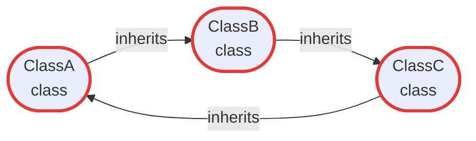
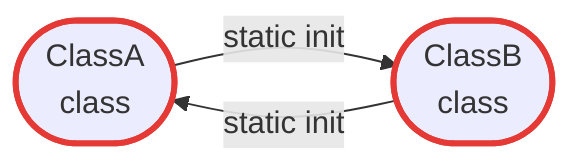
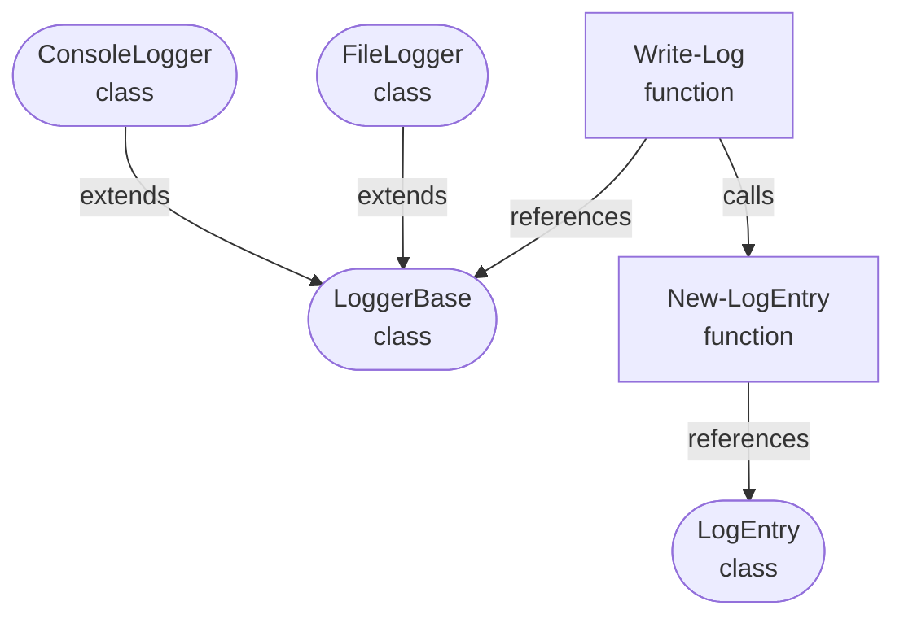
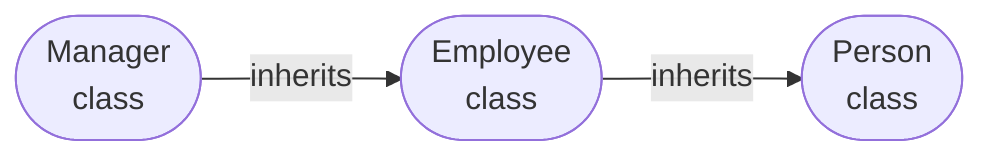

# Dependency Analysis

PSScriptBuilder uses PowerShell AST analysis to build a dependency graph of all collected
components and determine the correct load order for the generated output script. This ensures
that base classes always appear before derived classes, and that interdependent components are
placed in the right sequence — automatically, without any manual ordering.

The dependency graph is a directed graph where each node represents a component (class,
function, or enum) and each edge represents a dependency. An edge from `Employee` to `Person` means:
`Employee` depends on `Person`, so `Person` must appear first. Built-in types (`string`, `int`,
`bool`, `System.*`, etc.) are automatically excluded — only types that are part of the project
create graph edges.

When a collector processes a source file, the AST engine extracts the following dependency
information per component:

| Component | Dependencies extracted |
|---|---|
| Class | `BaseClass`, `TypeReferences` (properties, method parameters), `StaticInitializerReferences`, `CalledFunctions` |
| Function | `CalledFunctions`, `TypeReferences` |
| Enum | None — enums have no outgoing dependencies and always appear first |

## Circular Dependencies

PSScriptBuilder distinguishes two types of circular dependencies: fatal cycles and type reference
cycles. Understanding the difference is important — one prevents the build entirely, the other is
handled automatically.

### Fatal cycles

A cycle is fatal when it creates an unresolvable ordering constraint at PowerShell load time.
PowerShell processes a script file from top to bottom: before any code runs, it works through all
type definitions in order. A class must appear in the file after the types it depends on — otherwise,
PowerShell cannot resolve the type at load time and the script fails immediately with a type-not-found
error.

Two dependency types create this ordering constraint:

**Inheritance** — when class A inherits from class B, class B must already be defined at the point
where class A is loaded. If two classes inherit from each other — directly or through a chain —
there is no valid top-to-bottom order that satisfies both requirements at the same time.

A direct cycle involves just two classes:

```powershell title="Direct inheritance cycle"
class ClassA : ClassB { }  # ClassA requires ClassB to be defined first
class ClassB : ClassA { }  # ClassB requires ClassA to be defined first — impossible
```


A chain cycle can span any number of classes — the result is the same:

```powershell title="Chain inheritance cycle"
class ClassA : ClassB { }  # ClassA requires ClassB
class ClassB : ClassC { }  # ClassB requires ClassC
class ClassC : ClassA { }  # ClassC requires ClassA — cycle: A → B → C → A
```



**Static property initializers** — when PowerShell reads a class definition, it immediately runs
any static property initializer expressions. A static initializer is therefore not just a
declaration — it is code that executes at load time. Any type referenced in the initializer must
already be defined at that point — the same hard requirement as inheritance.

```powershell title="Mutual static initializer cycle"
class ClassA {
    static [ClassB] $Default = [ClassB]::new()  # [ClassB]::new() runs when ClassA loads
}

class ClassB {
    static [ClassA] $Default = [ClassA]::new()  # [ClassA]::new() runs when ClassB loads
}
```



If ClassA has a static initializer that references ClassB, and ClassB has a static initializer
that references ClassA, neither can be loaded first. This is just as fatal as a direct inheritance
cycle, and PSScriptBuilder treats it accordingly.

PSScriptBuilder detects both cycle types before attempting to sort and fails immediately with a
clear error that names all components involved. The error must be resolved in the source code —
there is no workaround.

### Type reference cycles

A type reference cycle occurs when two classes reference each other inside method bodies. At first
glance this looks like the same problem — but it is fundamentally different. Method bodies are not
executed when the class is loaded; they only run when the method is called. By the time any method
is called, all class definitions in the module have already been loaded and are available. So it
does not matter in which order the classes appear in the file.

```powershell title="Mutual type reference cycle"
class ClassA {
    [void] Run() {
        $b = [ClassB]::new()  # only executed when Run() is called, not on load
    }
}

class ClassB {
    [void] Run() {
        $a = [ClassA]::new()  # only executed when Run() is called, not on load
    }
}
```


Whether `ClassA` or `ClassB` appears first in the file makes no difference here. PowerShell
parses all class definitions in the output script together, so both types are known before any
method body is ever invoked.

PSScriptBuilder detects and resolves these cycles automatically. No build failure occurs and no
changes to the source code are required.

## Cross-Dependencies

Cross-dependencies arise when classes and functions must be interleaved in the output.
PSScriptBuilder detects this condition automatically — see below for when and why this
happens, and the [Templates Guide](templates.md#4-ordered-mode-and-hybrid-mode) for the required
template changes.

### Free Mode, Hybrid Mode, and Ordered Mode

Understanding when and why the mode switch happens is important for designing your project
structure.

**Free Mode** applies when all enums, classes, and functions can be cleanly separated in the
output — all enums first, then all classes in dependency order, then all functions. Each
collector maps to its own placeholder in the template; inter-collector ordering is controlled
by the position of those placeholders in the template.

**Ordered Mode** applies when the global dependency graph requires classes and functions
to be interleaved in the output — meaning it is not possible to output all classes as a single
block followed by all functions. PSScriptBuilder detects this automatically: after all components
are sorted in dependency order, any function that must appear before a class signals that
interleaving is required.

When this condition is detected, the template must be adapted — see the
[Templates Guide](templates.md#4-ordered-mode-and-hybrid-mode) for the required template structure.

**Hybrid Mode** applies when the template already contains the ordered-components placeholder
but `HasCrossDependencies` is `false`. This is an opt-in configuration for projects that
anticipate future cross-dependencies, or that simply prefer a single unified component block
regardless of the actual dependency structure. PSScriptBuilder handles Hybrid Mode and Ordered
Mode identically at validation and render time.

**Practical implication:** Whether Ordered Mode is triggered depends on the actual dependency
relationships between your classes and functions — not on how they are organized across
collectors or directories. Use `Get-PSScriptBuilderDependencyAnalysis` to check whether
cross-dependencies exist before designing your template. If they do, replace all per-type
placeholders for enums, classes, and functions with a single ordered-components placeholder
(default: `{{ORDERED_COMPONENTS}}`). Alternatively, use Hybrid Mode to adopt this layout
proactively, even when no cross-dependencies currently exist.

### Factory functions and cross-dependencies

A common source of unexpected cross-dependencies is a function that calls another function
which in turn depends on a class in the inheritance graph. Consider this scenario:



`Write-Log` depends on `LoggerBase` and on `New-LogEntry`. `New-LogEntry` depends on `LogEntry`.
The topological sort must place `New-LogEntry` after `LogEntry` but before `ConsoleLogger` and
`FileLogger` — which means a function has to appear between class definitions.
PSScriptBuilder detects the Function→Class transition and activates Ordered Mode.

The class hierarchy itself has no cycles and no direct class–function interleaving. The
cross-dependency is introduced entirely by the `Write-Log → New-LogEntry` call chain.

Replacing the factory call with a direct constructor call removes the function-to-function
dependency:

```powershell title="Factory call — PSScriptBuilder detects a cross-dependency"
Function Write-Log {
    param([LoggerBase] $Logger, [LogLevel] $Level, [string] $Message)
    $entry = New-LogEntry -Level $Level -Message $Message
    $Logger.Log($entry)
}
```

```powershell title="Direct constructor — no cross-dependency"
Function Write-Log {
    param([LoggerBase] $Logger, [LogLevel] $Level, [string] $Message)
    $entry = [LogEntry]::new($Level, $Message)
    $Logger.Log($entry)
}
```

With the direct constructor, no function depends on another function. The topological sort
places all classes first, then all functions, and PSScriptBuilder stays in Free Mode.

This is not a limitation — PSScriptBuilder correctly analyses what is actually in the code.
A factory call creates a real dependency, and PSScriptBuilder responds by choosing the mode
that guarantees a valid output. The choice between `[ClassName]::new(...)` and a factory
function is a design decision with consequences for the build mode.

| Situation | Recommendation |
|-----------|----------------|
| Project already uses `{{ORDERED_COMPONENTS}}` | Factory functions are fine — cross-dependencies are handled |
| Project uses per-type or per-layer placeholders | Prefer direct constructors to avoid unintentional cross-dependencies |
| Factory function contains logic beyond construction | Use it and accept Ordered Mode, or move the logic into the class constructor |

See [Example 10](../examples.md#10-multiple-collectors) for a complete project that
illustrates this behaviour.

## Cross-Collector Dependencies

PSScriptBuilder resolves all dependencies — inheritance, static initializers, and type references — across the full set of collectors combined. Within a single template placeholder, components are always output in the correct dependency order.

However, when components in **different collectors** depend on each other, the order of the template placeholders becomes critical. This applies equally to classes and functions:

- A class that inherits from a class in another collector requires that collector's placeholder to appear first in the template
- A function whose parameters reference a type from another collector requires the class collector's placeholder to appear first

PSScriptBuilder sorts components correctly within each placeholder block — but it cannot reorder placeholders in your template.

Consider two collectors where `DerivedClass` inherits from `BaseClass`, and `My-Function` has a parameter of type `BaseClass`:

```powershell title="Cross-collector dependencies"
$contentCollector = New-PSScriptBuilderContentCollector |
    Add-PSScriptBuilderCollector -Type Class    -CollectionKey "CORE_CLASSES"   -IncludePath "src\Core"      | # contains BaseClass
    Add-PSScriptBuilderCollector -Type Class    -CollectionKey "DOMAIN_CLASSES" -IncludePath "src\Domain"    | # contains DerivedClass : BaseClass
    Add-PSScriptBuilderCollector -Type Function -CollectionKey "MY_FUNCTIONS"   -IncludePath "src\Functions"  # contains My-Function([BaseClass] $obj)
```

The template **must** respect the dependency order across all three placeholders:

```powershell title="Correct template order"
{{CORE_CLASSES}}    # BaseClass defined here
{{DOMAIN_CLASSES}}  # DerivedClass : BaseClass — valid, BaseClass already loaded
{{MY_FUNCTIONS}}    # My-Function([BaseClass] $obj) — valid, BaseClass already loaded
```

```powershell title="Incorrect template order — generates invalid script"
{{MY_FUNCTIONS}}    # My-Function([BaseClass] $obj) — BaseClass not yet defined!
{{DOMAIN_CLASSES}}  # DerivedClass : BaseClass — BaseClass not yet defined!
{{CORE_CLASSES}}    # BaseClass is defined here, but too late
```

The wrong order produces a script that fails immediately at load time — before any code runs.
The error message (`type-not-found`) points to `BaseClass`, which may be hard to diagnose without
knowing the root cause. PSScriptBuilder emits a build warning when it detects this situation.

!!! tip "Avoid cross-collector dependencies when possible"
    The simplest way to avoid this problem is to consolidate related components into a single
    collector. Instead of splitting base classes and derived classes across two class collectors,
    use one collector that contains all of them — PSScriptBuilder will order them automatically.
    The same applies to functions: if interdependent functions share a single function collector,
    no cross-collector ordering is required.

    When components of **different types** depend on each other — for example, a function that
    uses a class — consolidation is not possible, since classes and functions require separate
    collectors. In this case, ensure that the class collector placeholder appears **before** the
    function collector placeholder in the template.

    Note that this only applies to **Free Mode**:
    in Ordered and Hybrid Mode, the `{{ORDERED_COMPONENTS}}` placeholder (or your configured key)
    handles the global ordering automatically.

## Topological Sort

The sort uses **Kahn's algorithm** and gives the following guarantees:

- Every prerequisite always appears before its dependents
- Enums are always placed first (they have no dependencies)

!!! note
    The relative order of independent components — those with no ordering constraint between
    them — may vary between runs. Kahn's algorithm processes components level by level. Within
    a level, all components are equally valid candidates. Their sequence within that level
    depends on the internal graph traversal order, which is not guaranteed to be stable.

The following example illustrates the guaranteed load order for a simple inheritance chain:



| Load order | Component | Reason |
|---|---|---|
| 1 | `Person` | No dependencies |
| 2 | `Employee` | Inherits from `Person` |
| 3 | `Manager` | Inherits from `Employee` |

---

## Walkthrough

### 1. Run a Dependency Analysis

[`Get-PSScriptBuilderDependencyAnalysis`](../cmdlets/Get-PSScriptBuilderDependencyAnalysis.md)
runs the full dependency analysis pipeline — collection, graph building, cycle detection, and
topological sort — and returns a result object with all findings. It does not produce any
output file. Use it to inspect the dependency structure of your project without performing a
build.

```powershell title="Run a dependency analysis"
$contentCollector = New-PSScriptBuilderContentCollector |
    Add-PSScriptBuilderCollector -Type Class    -IncludePath "src\Classes" |
    Add-PSScriptBuilderCollector -Type Function -IncludePath "src\Public"

$analysis = Get-PSScriptBuilderDependencyAnalysis -ContentCollector $contentCollector
```

Add `-Verbose` to see detailed output during collection and graph construction.

### 2. Inspect the Ordered Components

The `OrderedComponents` property contains all component names in the order they will appear
in the output script. This is the final result of the topological sort — the sequence that
guarantees every prerequisite appears before its dependents:

```powershell title="Inspect the ordered components"
Write-Host "Load order:"
$analysis.OrderedComponents | ForEach-Object { Write-Host "  - $_" }
```

If `HasCycles` is `true`, `OrderedComponents` is empty — sorting is not possible when an
Inheritance cycle exists. Type reference cycles are resolved automatically and do not set
`HasCycles`.

### 3. Check for Circular Dependencies

Before using the analysis result, always check whether a cycle was detected. The `HasCycles`
property indicates a problem; `CyclePath` names all components involved, with the first
component repeated at the end to show the closed loop:

```powershell title="Check for circular dependencies"
if ($analysis.HasCycles) {
    Write-Error "Circular dependency detected: $($analysis.CyclePath -join ' -> ')"
    return
}
```

Example cycle path output:

```title="Example cycle path"
ServiceA -> ServiceB -> ServiceC -> ServiceA
```

Fatal cycles — Inheritance and StaticInitializer — cause the build to fail immediately. Type
reference cycles are resolved automatically by PSScriptBuilder and do not appear in `CyclePath`.
Fatal cycles must be resolved in the source code before PSScriptBuilder can produce a valid output
script.

### 4. Check for Cross-Dependencies

When classes and functions are interleaved in the topological order, cross-dependencies exist
and the template must use the configured ordered-components placeholder
(default: `{{ORDERED_COMPONENTS}}`) instead of separate per-type placeholders.
The `HasCrossDependencies` property reports this condition:

```powershell title="Check for cross-dependencies"
if ($analysis.HasCrossDependencies) {
    Write-Host "Cross-dependencies detected — template must use the ordered components placeholder"
} else {
    Write-Host "Free mode — separate per-type placeholders work fine"
}
```

`HasCrossDependencies` is always `false` when `HasCycles` is `true`, since no sort is
performed in that case.

### 5. Inspect the Dependency Graph

The `DependencyGraph` property on the result object exposes two directional queries. The
**forward** direction answers "what does this component depend on?" — its prerequisites. The
**reverse** direction answers "what would be affected if this component changed?" — its
dependents. This is useful for understanding the impact of a change before making it:

```powershell title="Forward: what does ClassA depend on?"
$prerequisites = $analysis.DependencyGraph.GetDependencies("ClassA")
Write-Host "ClassA depends on: $($prerequisites -join ', ')"
```

```powershell title="Reverse (impact): what depends on BaseClass?"
$dependents = $analysis.DependencyGraph.GetDependents("BaseClass")
Write-Host "Changing BaseClass affects: $($dependents -join ', ')"
```

If no dependencies exist for a component — because it has none, or because no other component
depends on it — the result is an empty array, not an error.

### 6. Component Statistics

The `ComponentCounts` property provides a per-type breakdown of all collected components.
The `TotalComponents`, `TotalNodes`, and `TotalEdges` properties give a quick overview of the
size and complexity of the dependency graph:

```powershell title="Component statistics"
$counts = $analysis.ComponentCounts

Write-Host "Using statements: $($counts.UsingStatements)"
Write-Host "Enums:            $($counts.EnumDefinitions)"
Write-Host "Classes:          $($counts.ClassDefinitions)"
Write-Host "Functions:        $($counts.FunctionDefinitions)"
Write-Host "Files:            $($counts.FileContents)"
Write-Host "Total components: $($analysis.TotalComponents)"
Write-Host "Graph nodes:      $($analysis.TotalNodes)"
Write-Host "Graph edges:      $($analysis.TotalEdges)"
```

`TotalNodes` counts all components that participate in at least one dependency relationship — either as a dependent or as a prerequisite. A base class like `Person` with no outgoing dependencies is still counted as a node if another component depends on it. `TotalEdges` counts the number of dependency relationships between components.

### 7. Pre-Build Validation Pattern

Combining dependency analysis with a build call into a single script is the recommended
pattern for automated builds. Check for cycles first, report cross-dependencies if present,
then proceed with the build:

```powershell title="Pre-build validation pattern"
$contentCollector = New-PSScriptBuilderContentCollector |
    Add-PSScriptBuilderCollector -Type Class    -IncludePath "src\Classes" |
    Add-PSScriptBuilderCollector -Type Function -IncludePath "src\Public"

$analysis = Get-PSScriptBuilderDependencyAnalysis -ContentCollector $contentCollector

if ($analysis.HasCycles) {
    Write-Error "Build aborted — circular dependency: $($analysis.CyclePath -join ' -> ')"
    return
}

if ($analysis.HasCrossDependencies) {
    Write-Warning "Cross-dependencies detected — ensure template uses {{ORDERED_COMPONENTS}}"
}

Invoke-PSScriptBuilderBuild -ContentCollector $contentCollector `
    -TemplatePath "template.psm1" `
    -OutputPath   "output.psm1"
```

Note that `Invoke-PSScriptBuilderBuild` runs its own internal dependency analysis and will
also fail on cycles. The explicit pre-check is optional but recommended — it gives you the
full `CyclePath` details and allows you to handle the error gracefully before the build starts.

---

## Reference

### Analysis Result Properties

`Get-PSScriptBuilderDependencyAnalysis` returns a `PSScriptBuilderDependencyAnalysisResult`:

| Property | Type | Description |
|---|---|---|
| `HasCycles` | `bool` | Whether a circular dependency was detected |
| `CyclePath` | `string[]` | Components forming the cycle, e.g. `A → B → C → A`. Empty if no cycle. |
| `HasCrossDependencies` | `bool` | Whether classes and functions are interleaved in the sorted order. Always `false` if `HasCycles` is `true`. |
| `OrderedComponents` | `string[]` | Topologically sorted component names, enums first. Empty if `HasCycles` is `true`. |
| `ComponentCounts` | `PSScriptBuilderBuildComponentCounts` | Per-type counts: `UsingStatements`, `EnumDefinitions`, `ClassDefinitions`, `FunctionDefinitions`, `FileContents` |
| `TotalComponents` | `int` | Sum of all `ComponentCounts` fields |
| `TotalNodes` | `int` | Number of nodes in the dependency graph |
| `TotalEdges` | `int` | Number of edges (dependency relationships) in the graph |
| `DependencyGraph` | `PSScriptBuilderDependencyGraph` | The full graph object for advanced queries |

### Dependency Graph Methods

| Method | Direction | Description |
|---|---|---|
| `GetDependencies(name)` | Forward | Prerequisites of `name` — what it depends on |
| `GetDependents(name)` | Reverse / Impact | What depends on `name` — would be affected by changes |
| `GetAllNodes()` | — | All component names in the graph |
| `HasNode(name)` | — | Whether a component is present in the graph |
| `GetNodeCount()` | — | Total number of nodes |
| `GetEdgeCount()` | — | Total number of dependency edges |

---

## Tips

!!! warning "Cycles block the build"
    `Invoke-PSScriptBuilderBuild` fails immediately when cycles exist. Use
    `Get-PSScriptBuilderDependencyAnalysis` beforehand to get the full `CyclePath` and
    diagnose the problem before running the build.

!!! tip "Cross-dependencies require a template change"
    If `HasCrossDependencies` is `true`, the template must use the configured
    ordered-components placeholder (default: `{{ORDERED_COMPONENTS}}`).
    A mismatched template will fail validation before the build starts — so it is safe
    to catch this early with a pre-build analysis.

!!! tip "Use the impact analysis before refactoring"
    `GetDependents()` tells you which components would be affected by a change to a given
    class or function. This is useful for assessing the scope of a refactoring before
    making any changes to the source code.

!!! info "Missing dependency in the graph?"
    If a type reference is not visible in the graph, it is likely an external type — a
    built-in PowerShell type or one from another module. External types are automatically
    excluded and do not create graph edges.

---

## See Also

- [Cmdlet Reference: Get-PSScriptBuilderDependencyAnalysis](../cmdlets/Get-PSScriptBuilderDependencyAnalysis.md)
- [Templates Guide](templates.md) — how dependency analysis affects the template validation mode
- [Collectors Guide](collectors.md) — configure collectors to feed the dependency analysis
