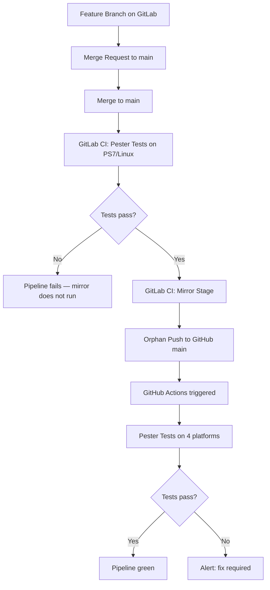
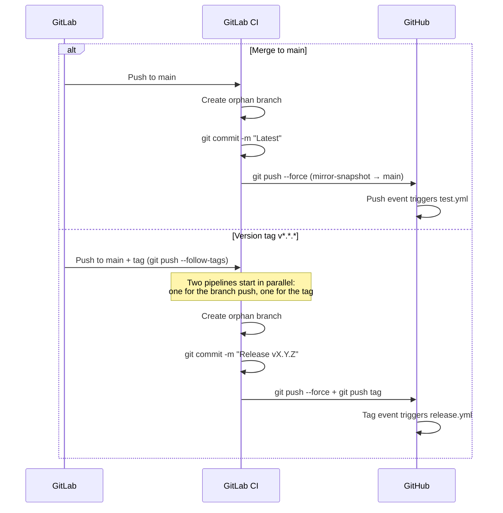
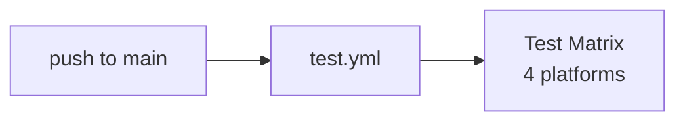
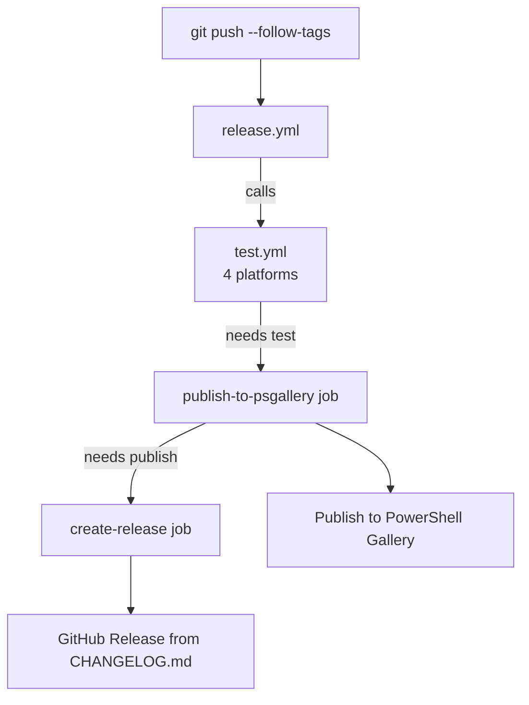
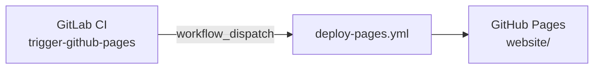
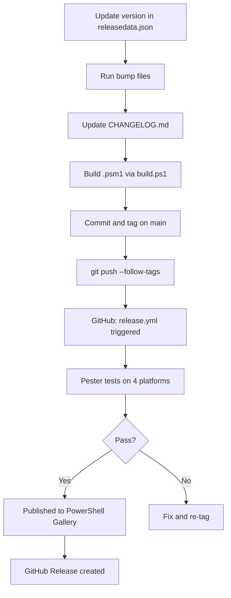

# CI/CD Pipeline

This document describes the complete CI/CD pipeline for PSScriptBuilder: development on GitLab, mirroring to GitHub, automated testing, and publishing.

---

## Platform Overview

| Platform | Role |
|---|---|
| **GitLab** | Primary development platform — all development, commits, and merges happen here |
| **GitHub** | Public mirror — single "Latest" commit, no development history |
| **PowerShell Gallery** | Distribution — published automatically on Git tag |

---

## Development Workflow

---

## GitLab Pipeline

File: `.gitlab-ci.yml`

**Stages:**

| Stage | Job | Trigger |
|---|---|---|
| `secret-detection` | `secret_detection` | Every push (GitLab built-in template) |
| `test` | `pester-tests` | Merge to `main` or version tag `v*.*.*` |
| `mirror` | `mirror-to-github` | Merge to `main` or version tag `v*.*.*` |
| `deploy` | `trigger-github-pages` | Merge to `main` when `website/**` changed |

The `trigger-github-pages` job calls the GitHub API to dispatch the `deploy-pages.yml` workflow — it runs after `mirror-to-github` to ensure GitHub has the latest code before deploying.

**Mirror mechanism:**

The mirror stage creates an orphan branch (no commit history) with the current state and force-pushes it to GitHub as a single commit named `"Latest"`. This keeps the internal development history private.

---

## GitHub Actions Workflows

### Workflow Dependencies

**Development push (`push to main`):**

Every merge to `main` on GitLab triggers the GitLab CI pipeline. Once `pester-tests` and `secret_detection` pass, the `mirror-to-github` job pushes the current state to GitHub. That push event on GitHub `main` triggers `test.yml` directly.

The purpose is to validate every merged change against the full platform matrix (PS5.1, PS7 on Windows, Linux, macOS) — coverage that the GitLab pipeline alone (PS7/Linux only) does not provide.

**Release (`git push --follow-tags`):**

`git push --follow-tags` sends both the branch and the annotated tag to GitLab in a single transaction. GitLab starts two pipelines in parallel — one for the branch push, one for the tag push. Both run `pester-tests` and `mirror-to-github`. The tag pipeline additionally pushes the tag to GitHub, which triggers `release.yml`.

`release.yml` is the release orchestrator. It runs three jobs sequentially:

1. **`test`** — calls `test.yml` via `workflow_call`. Runs the full Pester test suite on all 4 platforms. All subsequent jobs are blocked if this fails.
2. **`publish-to-psgallery`** — runs `publish.ps1`, which calls `Publish-PSResource` to upload `build/Output/` to the PowerShell Gallery using `PSGALLERY_API_KEY`. Blocked if `test` failed.
3. **`create-release`** — extracts the release notes for the current version from `CHANGELOG.md` and creates a GitHub Release with that content. Blocked if `publish-to-psgallery` failed — a GitHub Release is only created when the module has actually been published.

Note: `test.yml` runs twice during a release — once triggered directly by the branch push (from the mirror), and once called internally by `release.yml`. This is an accepted trade-off of the `--follow-tags` push strategy and does not affect correctness.

**Pages deployment (`workflow_dispatch`):**

The GitLab CI `trigger-github-pages` job calls the GitHub API to dispatch `deploy-pages.yml` whenever `website/**` changes on `main`. This workflow deploys the static `website/` directory to GitHub Pages. It is triggered via `workflow_dispatch` rather than a push event because the content lives in GitLab and arrives on GitHub only as an orphan snapshot — not as a regular branch push that GitHub Actions could filter on.

### test.yml

Triggered by: `push` to `main`, `workflow_call` (from release.yml)

Test matrix:

| OS | Shell | Label |
|---|---|---|
| windows-latest | powershell | PS5.1 |
| windows-latest | pwsh | PS7-Windows |
| ubuntu-latest | pwsh | PS7 |
| macos-latest | pwsh | PS7-macOS |

### release.yml

Triggered by: Git tag matching `v[0-9]+.[0-9]+.[0-9]+`

Jobs (in order):
1. `test` — calls `test.yml` via `workflow_call` (4 platforms)
2. `publish-to-psgallery` — runs `publish.ps1` to publish to PowerShell Gallery using `PSGALLERY_API_KEY`
3. `create-release` — extracts release notes from `CHANGELOG.md` and creates a GitHub Release

### deploy-docs.yml

Triggered by: `push` to `main` when `docs/**` or `mkdocs.yml` changed

Independent of test pipeline — deploys MkDocs site to the external `PSScriptBuilder-Docs` repository via `DOCS_DEPLOY_TOKEN`.

### deploy-pages.yml

Triggered by: `workflow_dispatch` (called from GitLab CI `trigger-github-pages` job)

Deploys the `website/` directory to GitHub Pages. Only runs when `website/**` has changed on `main`. The GitLab CI job calls the GitHub API to dispatch this workflow after the mirror stage completes.

---

## Release Process

---

## Required Secrets

| Secret | Platform | Used by |
|---|---|---|
| `GITHUB_TOKEN` | GitLab CI Variable | `mirror-to-github` job |
| `PSGALLERY_API_KEY` | GitLab CI Variable + GitHub Secret | `release.yml` |
| `DOCS_DEPLOY_TOKEN` | GitHub Secret | `deploy-docs.yml` |

See `internal/cicd-publishing-strategy.md` for setup instructions.

---

## Known Issues & Pitfalls

### Protected Variables require Protected Tags (GitLab)

GitLab CI variables marked as "Protected" are only injected into pipelines triggered by a protected branch or protected tag. If the `GITHUB_TOKEN` variable is protected and the tag `v1.0.0` is not listed under a protected tag pattern, the variable is empty and the mirror job fails with "Invalid username or token".

**Fix:** Add `v*` as a Protected Tag pattern in GitLab → Settings → Repository → Protected tags.

### PSResourceRepository.xml not present on Linux runners

Fresh GitHub Actions Linux runners do not have the PSResourceGet repository store initialized. `Publish-PSResource` fails with "PSResourceRepository.xml not found" if PSGallery has not been registered.

**Fix already in place:** `scripts/publish.ps1` calls `Register-PSResourceRepository -PSGallery -Trusted` if PSGallery is not yet registered.

### `grep` exit code 1 breaks shell scripts with `set -e`

`grep` returns exit code 1 when no match is found. In shell scripts running under `set -e` (GitLab CI default), this terminates the job immediately even though "no match" is a valid outcome.

**Fix already in place:** All `grep` calls in `.gitlab-ci.yml` that may legitimately find no match append `|| true`.

### Existing tag on GitHub is rejected on re-push

If a tag is deleted locally and recreated (e.g. after a pipeline fix), GitHub rejects the push with "already exists" because the tag still points to the old commit on GitHub.

**Fix already in place:** The `mirror-to-github` job in `.gitlab-ci.yml` uses `git push github $CI_COMMIT_TAG --force` to overwrite the existing tag on GitHub.
