# Regex Replacement Architecture

## Overview

The `PSScriptBuilderRegexHelper` class implements two distinct modes for token replacements in bump files:

- **MODE 1**: Placeholder-based replacements (`{{TOKEN}}`)
- **MODE 2**: Regex-based replacements with capture groups (`{REGEX_TOKEN}`)

## Router Logic

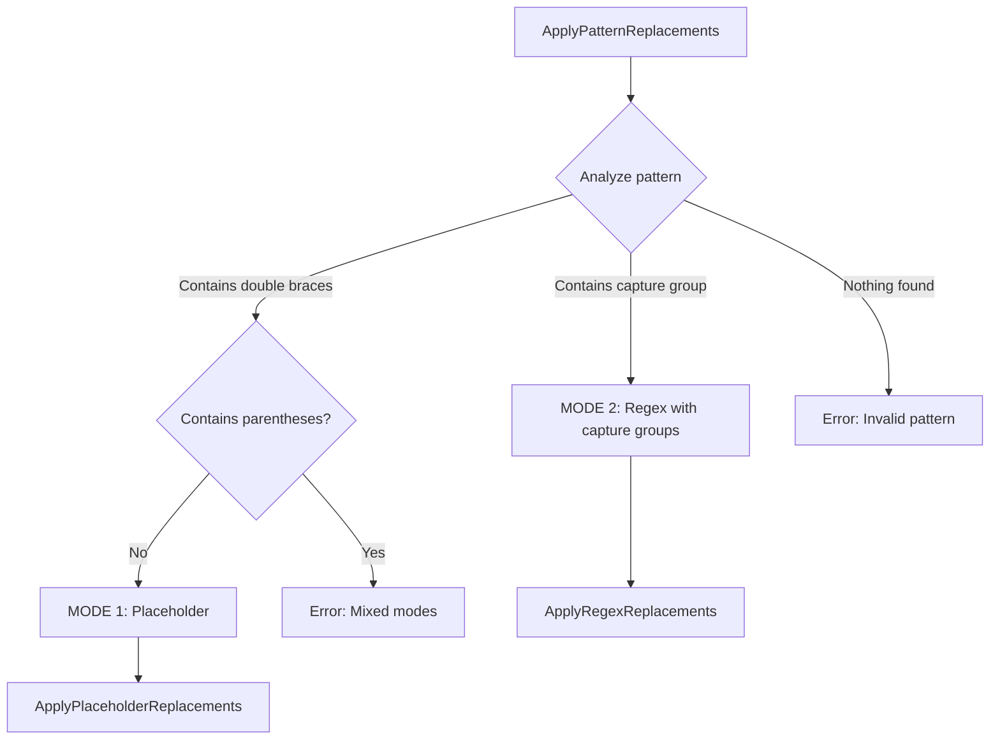

## MODE 1: Placeholder-Based Replacements

### Flow

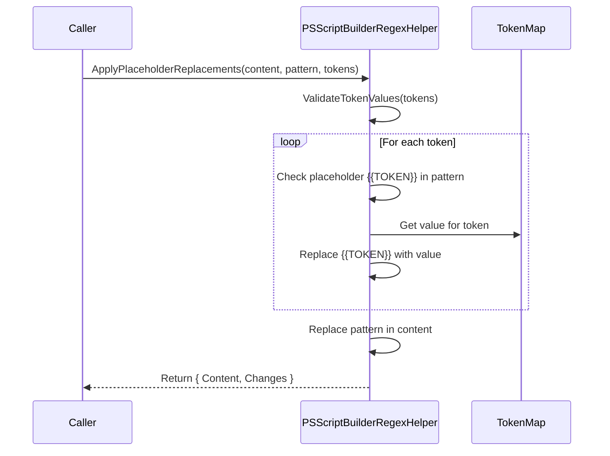

### Example

```
Pattern:  "Version = '{{VERSION}}'"
Token:    ["VERSION"]
TokenMap: { VERSION = "1.2.3" }

Result: "Version = '1.2.3'"
```

## MODE 2: Regex-Based Replacements with Capture Groups

### Overall Flow

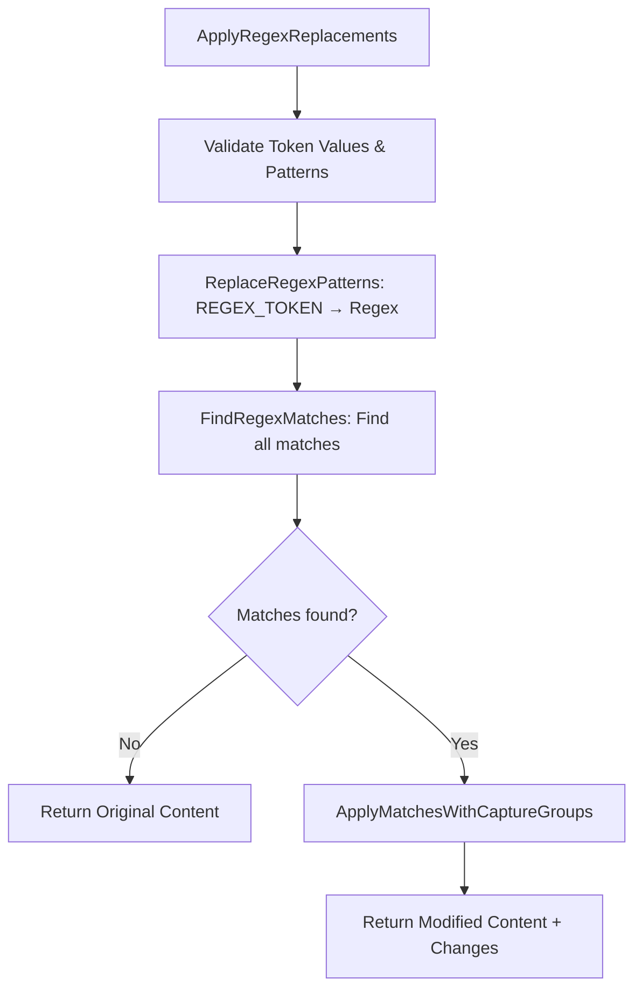

### Position-Based Capture Group Replacement (Core Algorithm)

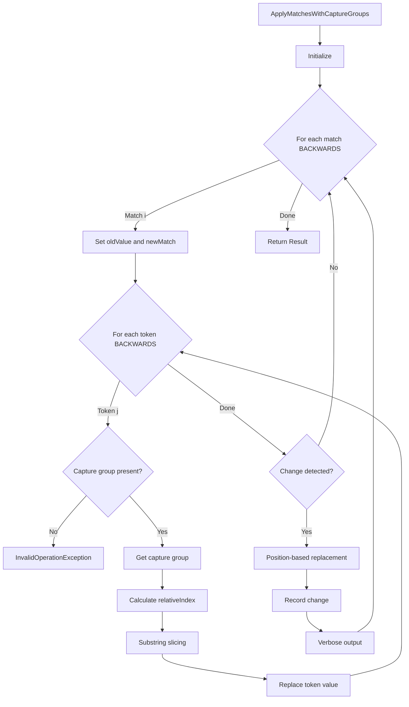

### Why Back-to-Front Processing?

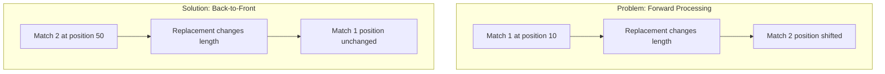

### Position-Based Replacement in Detail

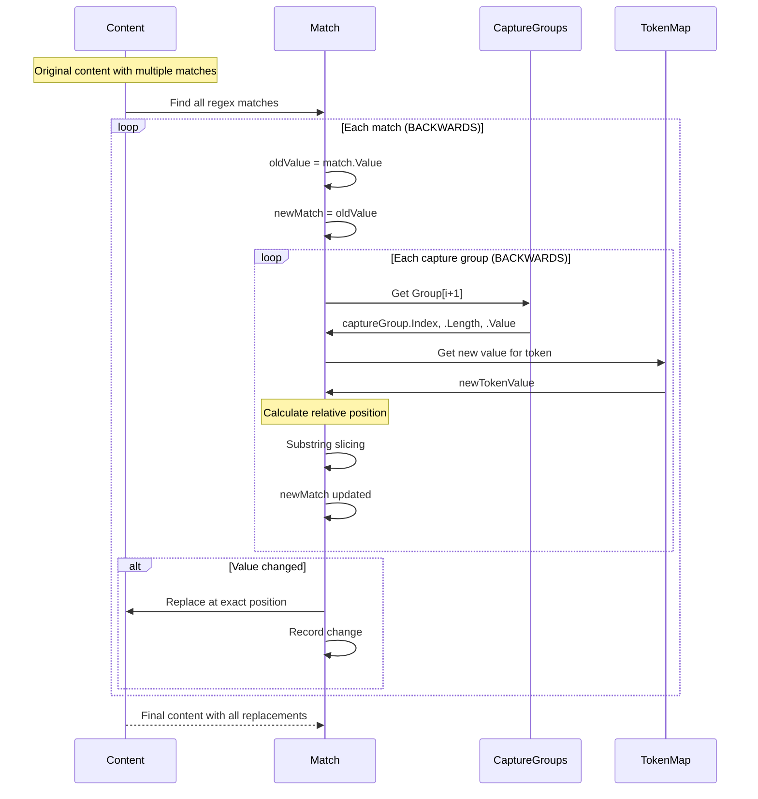

## Example: Multiline Replacement with 3 Tokens

### Input

```
Pattern: \.DATEMODIFIED\r?\n\s+({REGEX_BUILD_DATE}) ({REGEX_BUILD_HOUR}):({REGEX_BUILD_MINUTE})
Tokens:  ["BUILD_DATE", "BUILD_HOUR", "BUILD_MINUTE"]

Content:
.DATEMODIFIED
    2026-02-05 16:27

TokenMap:
  BUILD_DATE   = "2026-02-11"
  BUILD_HOUR   = "14"
  BUILD_MINUTE = "35"
```

### Processing


### Output

```
Content:
.DATEMODIFIED
    2026-02-11 14:35

Verbose Output (formatted):
Regex match replaced: .DATEMODIFIED[CRLF][space:4]2026-02-05 16:27 -> .DATEMODIFIED[CRLF][space:4]2026-02-11 14:35
```

## Verbose Output Formatting

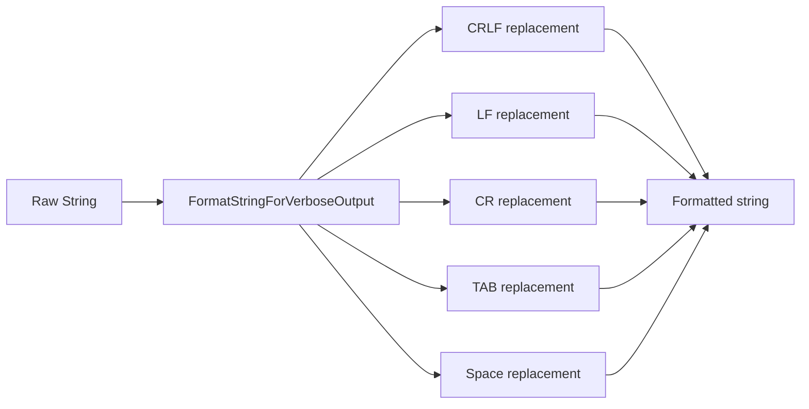

### Example

```
Before: ".DATEMODIFIED\r\n    2026-02-05 16:27"
After:  ".DATEMODIFIED[CRLF][space:4]2026-02-05 16:27"
```

## Critical Design Decisions

### 1. Why Position-Based Instead of String.Replace?

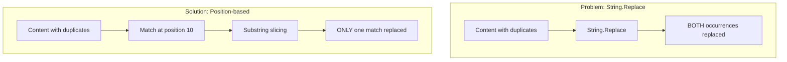

### 2. Why Capture Groups Instead of Denormalization?

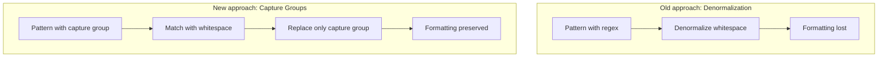

### 3. Relative vs. Absolute Indexing

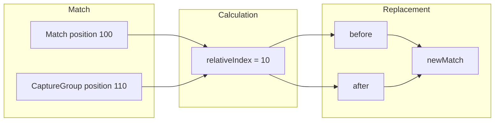

## Token Validation

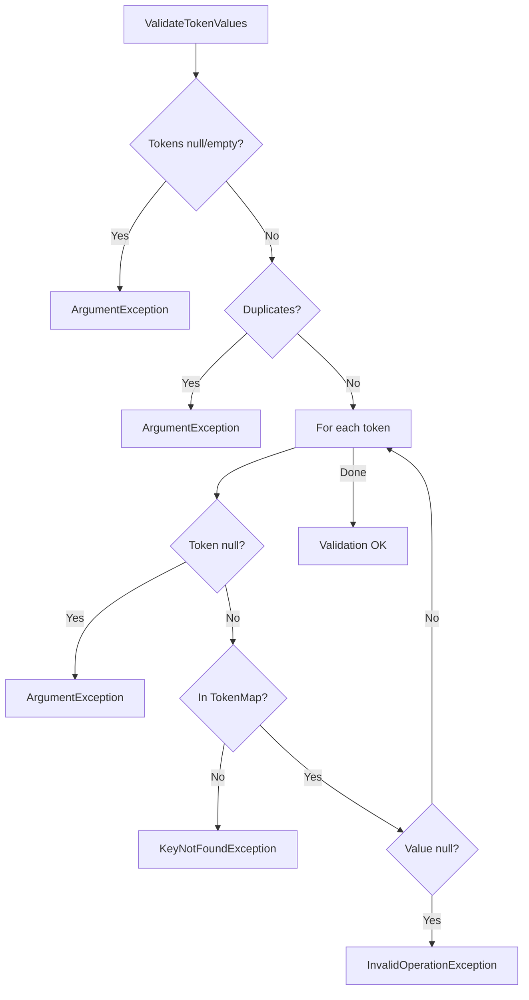

## Regex Pattern Replacement

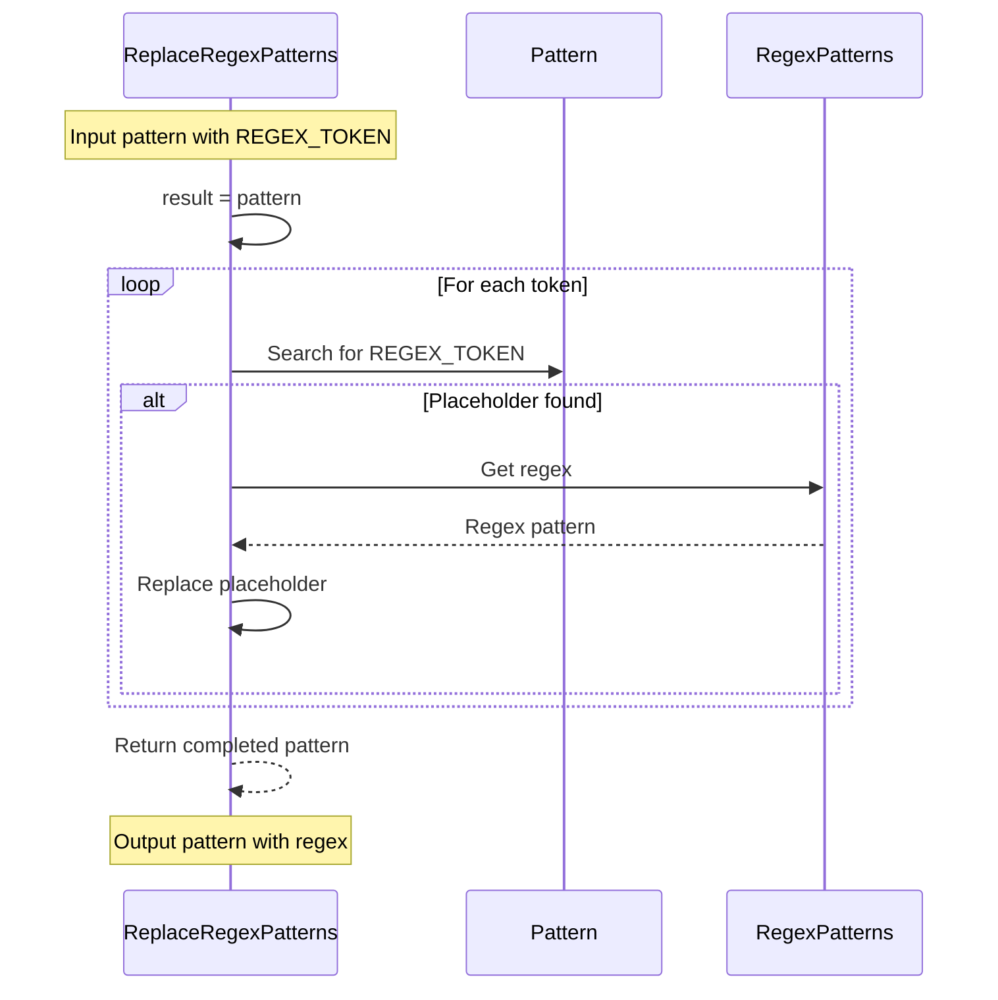

### Example

```
Input:
  Pattern: "Version\s*=\s*'({REGEX_VERSION})'"
  Token:   ["VERSION"]
  RegexPatterns: { VERSION = "\d+\.\d+\.\d+" }

Output:
  Pattern: "Version\s*=\s*'(\d+\.\d+\.\d+)'"
```

## Performance Considerations

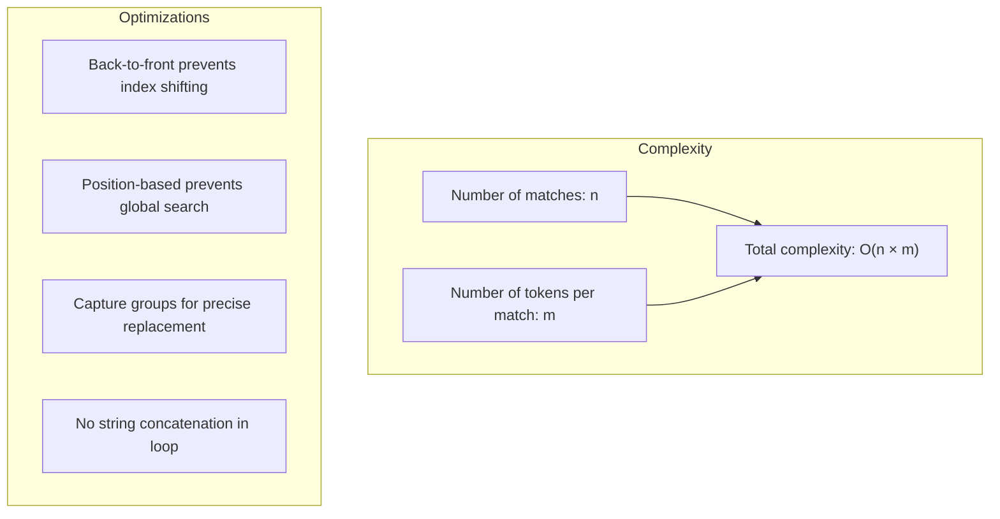

### Typical Scenarios

| Scenario | Matches | Tokens | Operations | Time |
|----------|---------|--------|------------|------|
| Single Pattern | 1 | 1 | O(1) | ~1ms |
| Multiple Patterns | 5 | 1 | O(5) | ~5ms |
| Multiline Pattern | 1 | 3 | O(3) | ~3ms |
| Complex File | 10 | 2 | O(20) | ~20ms |

## Edge Cases

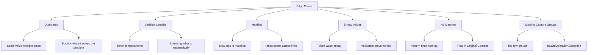

## Summary

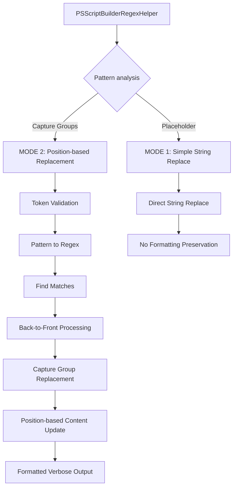

### Advantages of the Current Design

1. **Formatting preserved**: Spaces, tabs, and newlines are not modified
2. **Multiline support**: Patterns spanning multiple lines work correctly
3. **Multi-token support**: Multiple tokens in a single pattern are supported
4. **No duplicate issues**: Position-based replacement prevents global changes
5. **Robust validation**: Early errors for invalid tokens/patterns
6. **Readable output**: Formatted verbose messages for debugging

### PowerShell 5.1 Compatibility

- No ternary operators
- No interfaces
- `for` loops instead of `foreach` for index control
- Constructor overloading is supported
- .NET Regex with MatchCollection works correctly
