# Regex Replacement Architecture

## Übersicht

Die `PSScriptBuilderRegexHelper` Klasse implementiert zwei verschiedene Modi für Token-Ersetzungen in Bump-Dateien:

- **MODUS 1**: Placeholder-basierte Ersetzungen (`{{TOKEN}}`)
- **MODUS 2**: Regex-basierte Ersetzungen mit Capture Groups (`{REGEX_TOKEN}`)

## Router-Logik

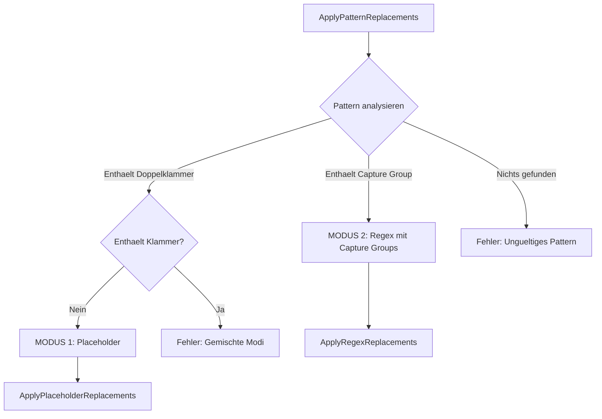

## MODUS 1: Placeholder-basierte Ersetzungen

### Ablauf

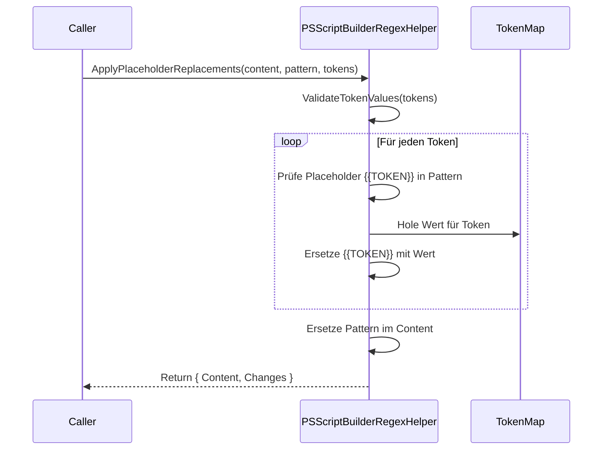

### Beispiel

```
Pattern:  "Version = '{{VERSION}}'"
Token:    ["VERSION"]
TokenMap: { VERSION = "1.2.3" }

Ergebnis: "Version = '1.2.3'"
```

## MODUS 2: Regex-basierte Ersetzungen mit Capture Groups

### Gesamt-Ablauf

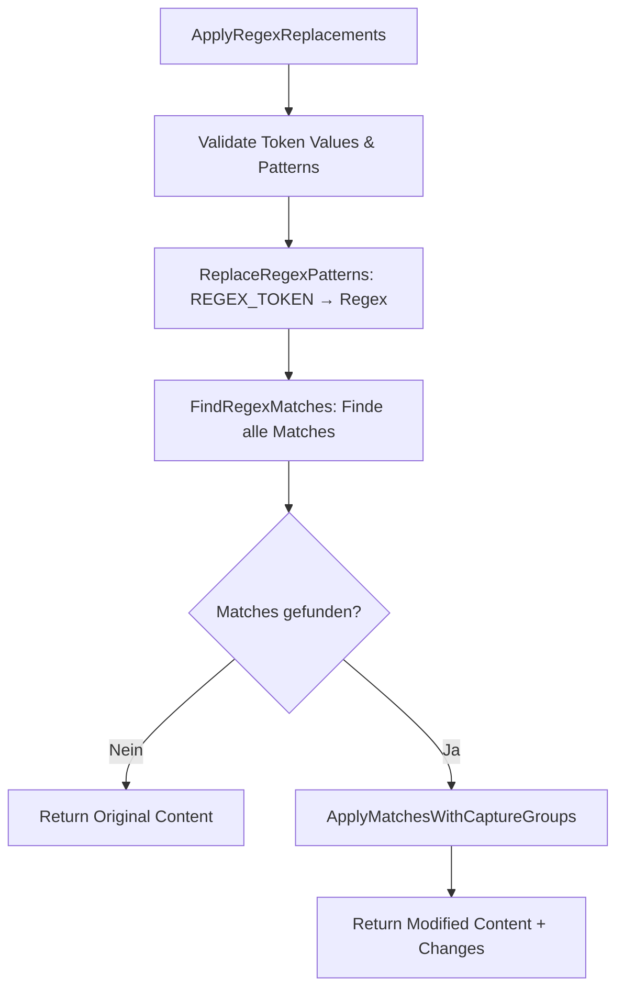

### Position-basierte Capture Group Ersetzung (Kern-Algorithmus)

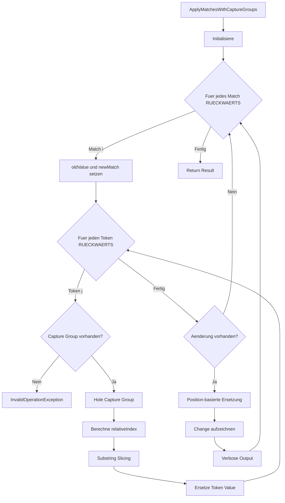

### Warum Back-to-Front Processing?

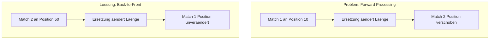

### Position-basierte Ersetzung im Detail

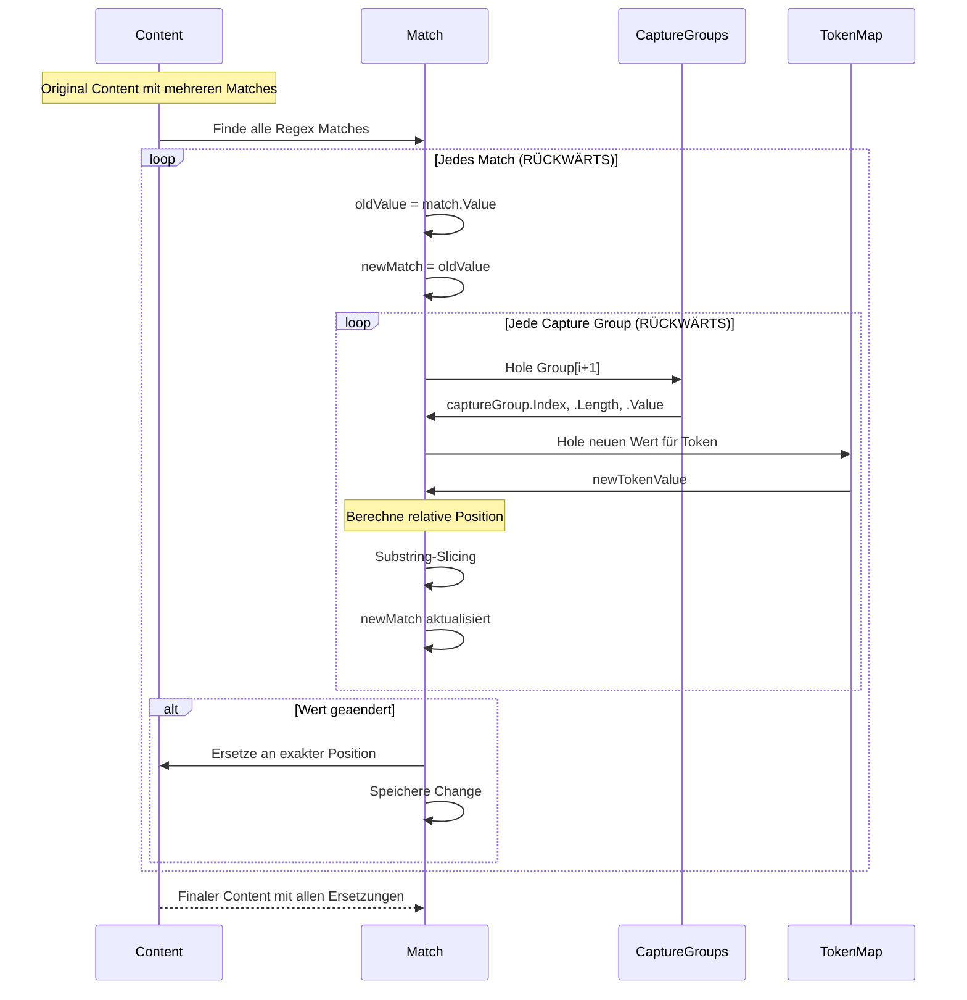

## Beispiel: Multiline-Ersetzung mit 3 Tokens

### Input

```
Pattern: \.DATEMODIFIED\r?\n\s+({REGEX_BUILD_DATE}) ({REGEX_BUILD_HOUR}):({REGEX_BUILD_MINUTE})
Tokens:  ["BUILD_DATE", "BUILD_HOUR", "BUILD_MINUTE"]

Content:
.DATEMODIFIED
    2026-02-05 16:27

TokenMap:
  BUILD_DATE   = "2026-02-11"
  BUILD_HOUR   = "14"
  BUILD_MINUTE = "35"
```

### Verarbeitung

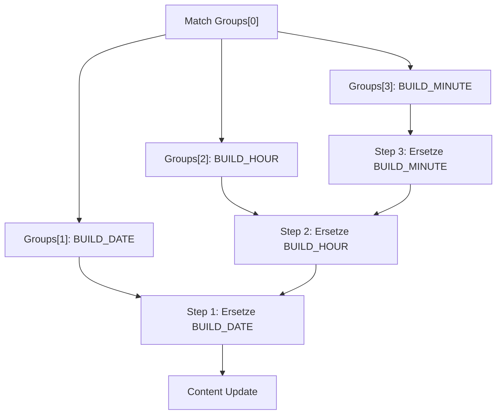

### Output

```
Content:
.DATEMODIFIED
    2026-02-11 14:35

Verbose Output (formatiert):
Regex match replaced: .DATEMODIFIED[CRLF][space:4]2026-02-05 16:27 -> .DATEMODIFIED[CRLF][space:4]2026-02-11 14:35
```

## Verbose Output Formatierung

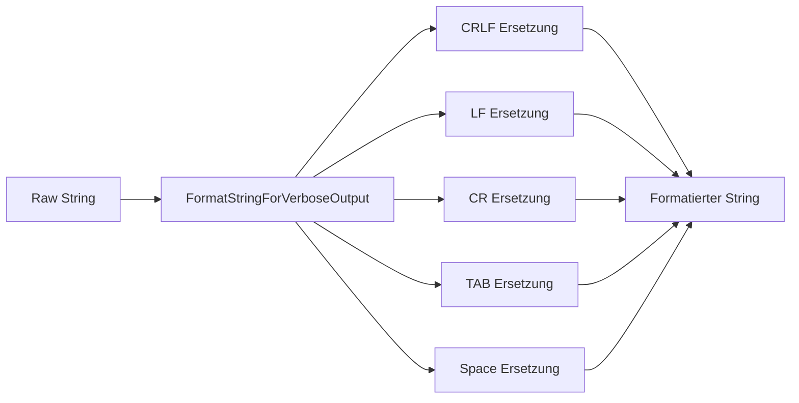

### Beispiel

```
Vorher:  ".DATEMODIFIED\r\n    2026-02-05 16:27"
Nachher: ".DATEMODIFIED[CRLF][space:4]2026-02-05 16:27"
```

## Kritische Designentscheidungen

### 1. Warum Position-basiert statt String.Replace?

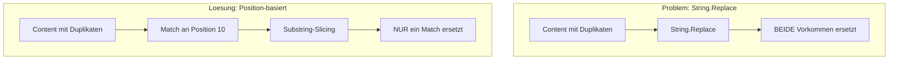

### 2. Warum Capture Groups statt Denormalization?

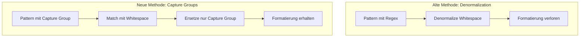

### 3. Relative vs. Absolute Indexierung

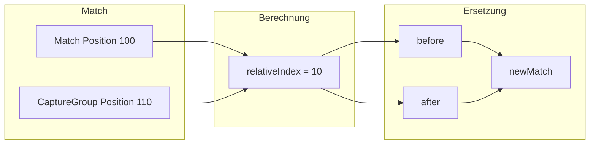

## Token Validation

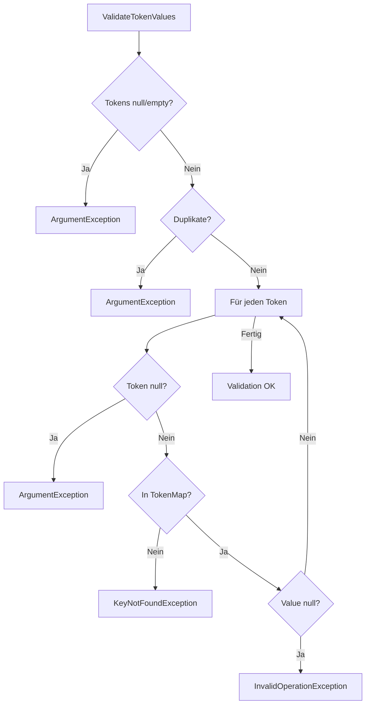

## Regex Pattern Ersetzung

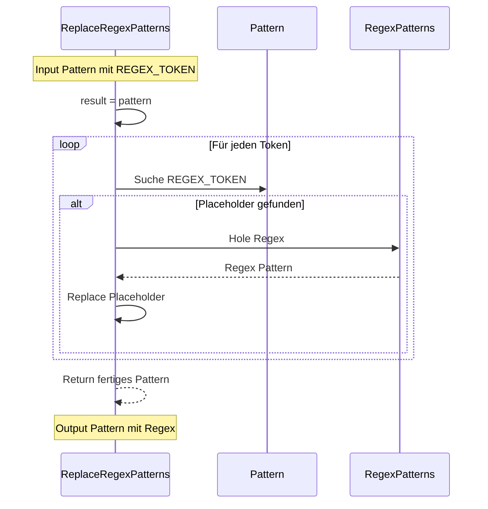

### Beispiel

```
Input:
  Pattern: "Version\s*=\s*'({REGEX_VERSION})'"
  Token:   ["VERSION"]
  RegexPatterns: { VERSION = "\d+\.\d+\.\d+" }

Output:
  Pattern: "Version\s*=\s*'(\d+\.\d+\.\d+)'"
```

## Performance-Überlegungen

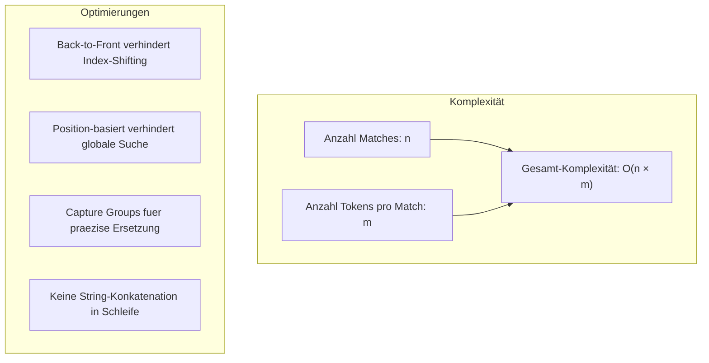

### Typische Szenarien

| Szenario | Matches | Tokens | Operationen | Zeit |
|----------|---------|--------|-------------|------|
| Single Pattern | 1 | 1 | O(1) | ~1ms |
| Multiple Patterns | 5 | 1 | O(5) | ~5ms |
| Multiline Pattern | 1 | 3 | O(3) | ~3ms |
| Complex File | 10 | 2 | O(20) | ~20ms |

## Edge Cases

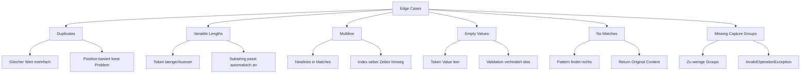

## Zusammenfassung

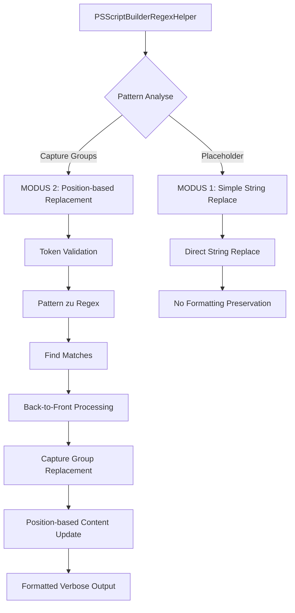

### Vorteile des aktuellen Designs

1. **Formatierung bleibt erhalten**: Spaces, Tabs, Newlines werden nicht verändert
2. **Multiline-Support**: Patterns über mehrere Zeilen funktionieren
3. **Multi-Token-Support**: Mehrere Tokens in einem Pattern möglich
4. **Keine Duplikat-Probleme**: Position-basierte Ersetzung verhindert globale Änderungen
5. **Robuste Validation**: Frühzeitige Fehler bei ungültigen Tokens/Patterns
6. **Lesbare Ausgabe**: Formatierte Verbose-Messages für Debugging

### PowerShell 5.1 Kompatibilitaet

- Keine Ternary Operators
- Keine Interfaces
- for Loops statt foreach fuer Index-Kontrolle
- Constructor Overloading wird unterstuetzt
- .NET Regex mit MatchCollection funktioniert
