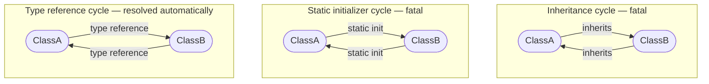

# Refactoring Plan: StaticInitializer Edge Type

## Background

### Problem

Static property initializers in PowerShell 5.1 classes are executed at **load time**, not at
method invocation time:

```powershell
class A {
    static [B] $Default = [B]::new()  # Executed when the .psm1 is loaded
}
```

This means `A` has a hard load-order constraint on `B` — identical in severity to inheritance.
If `A` and `B` form a cycle via static initializers (directly or transitively), no valid load
order exists and the generated script will fail at runtime.

### Why the current design is insufficient

After the typed-edge refactoring, static initializer type references are stored as
`TypeReference` edges. The `CycleDetector` only traverses `Inheritance` edges and therefore
does not detect static initializer cycles. The `TopologicalSorter` sub-graph pass only uses
`Inheritance` edges when ordering stuck nodes, so a static initializer constraint between two
stuck nodes is ignored.

**Observable symptom:** A project with:
```powershell
class A { static [B] $x = [B]::new() }
class B { static [A] $y = [A]::new() }
```
produces a build result with `HasCycles = false`, a "valid" output script, and a runtime
error when the script is loaded.

### Decision

Introduce a new enum value `StaticInitializer` in `PSScriptBuilderDependencyEdgeType`.
The AstEngine gains a new method `GetStaticInitializerTypeReferences()` that extracts only the
type references from static property initializer expressions. `GetTypeReferences()` is updated
to **exclude** these references. The `ClassCollector` calls both methods and passes the results
separately to `ClassData`. The `GraphBuilder` creates `StaticInitializer` edges for static
initializer references. The `CycleDetector` and `TopologicalSorter` treat `StaticInitializer`
edges identically to `Inheritance` edges.

---

## Scope

### New files

None.

### Changed source files

| File | Change scope |
|---|---|
| `PSScriptBuilderDependencyEdgeType.ps1` | Add `StaticInitializer = 3`; update `TypeReference` description to remove "static initializer" (which is now its own edge type) |
| `PSScriptBuilderAstEngine.ps1` | New private `IsInsideAnyExtent()` helper; new public `GetStaticInitializerTypeReferences()` method; update `GetTypeReferences()` to exclude static initializer extents |
| `PSScriptBuilderClassData.ps1` | New `StaticInitializerReferences [string[]]` property; update constructor |
| `PSScriptBuilderClassCollector.ps1` | Call both `GetTypeReferences()` and `GetStaticInitializerTypeReferences()`; pass to `ClassData` |
| `PSScriptBuilderDependencyGraph.ps1` | Fix `AddEdge` duplicate check to `(Target, EdgeType)` pair; update CBH `.DESCRIPTION` |
| `PSScriptBuilderDependencyGraphBuilder.ps1` | Add `AddStaticInitializerEdges()` helper; fix `TryAddEdge` duplicate check; call new helper in `ProcessClassDependencies()` |
| `PSScriptBuilderCycleDetector.ps1` | `DfsHasCycle()` and `DfsGetCyclePath()` traverse both `Inheritance` and `StaticInitializer` edges |
| `PSScriptBuilderTopologicalSorter.ps1` | Sub-graph pass includes `StaticInitializer` edges alongside `Inheritance`; update `Sort()` CBH description and `Write-Verbose` message |

### Changed documentation / CBH files

| File | Change scope |
|---|---|
| `src/Public/Get-PSScriptBuilderDependencyAnalysis.ps1` | Update `.NOTES` to mention `StaticInitializer` cycles alongside `Inheritance` cycles |
| `docs/guides/dependency-analysis.md` | Update "Circular Dependencies" section and component table to reflect new `StaticInitializer` edge type |
| `docs/cmdlets/Get-PSScriptBuilderDependencyAnalysis.md` | Sync NOTES section with CBH |

### Changed test files

| File | Change scope |
|---|---|
| `PSScriptBuilderAstEngine.Tests.ps1` | New context: `GetStaticInitializerTypeReferences`; update `GetTypeReferences` context (3 new tests) |
| `PSScriptBuilderClassData.Tests.ps1` | Update 9 constructor calls to 7-parameter form; add `StaticInitializerReferences` property test |
| `PSScriptBuilderClassCollector.Tests.ps1` | New test: static initializer collected separately from type references |
| `PSScriptBuilderDependencyGraph.Tests.ps1` | New test: `TypeReference` + `StaticInitializer` to same target produces 2 edges |
| `PSScriptBuilderDependencyGraphBuilder.Tests.ps1` | Update `New-ClassCollectorWithData` to 7-parameter form; new test: static initializer edge |
| `PSScriptBuilderCrossDependencyDetector.Tests.ps1` | Update `New-Detector` helper (2 call sites) to 7-parameter `ClassData` constructor |
| `PSScriptBuilderCycleDetector.Tests.ps1` | New context: `StaticInitializer` cycle is detected |
| `PSScriptBuilderTopologicalSorter.Tests.ps1` | New test: stuck-node sub-sort respects `StaticInitializer` ordering; new test: direct `StaticInitializer` cycle throws `InvalidOperationException` |

---

## Detailed Specification

### 1. `PSScriptBuilderDependencyEdgeType` — new value + description update

**New value:**

```powershell
StaticInitializer = 3
```

**Meaning:** The source class has a static property whose initializer expression references the
target type. This constraint is load-time fatal, identical to `Inheritance`.

**Update `TypeReference` description:**

The current `.DESCRIPTION` for `TypeReference` reads:
> *"Represents a type usage in a method body, property type annotation, or static initializer."*

After this refactoring, static initializers have their own edge type. Remove "or static
initializer" from the description:
> *"Represents a type usage in a method body or property type annotation."*

Updated fatal-at-load-time table:

| Value | Meaning | Fatal in PS 5.1? |
|---|---|---|
| `Inheritance` | Class inherits from another class | Yes |
| `TypeReference` | Type used in a method body or property type annotation | No |
| `FunctionCall` | Call to a project-defined function | No |
| `StaticInitializer` | Type used in a static property initializer expression | **Yes** |

---

### 2. `PSScriptBuilderAstEngine` — three changes

#### New private helper: `IsInsideAnyExtent([Ast] $node, [List[IScriptExtent]] $extents)`

This method is the low-level building block for the extent-exclusion filter. It must be
implemented **before** the changes to `GetTypeReferences()` because that method depends on it.

```powershell
hidden static [bool] IsInsideAnyExtent([Ast] $node, [List[IScriptExtent]] $extents) {
    foreach ($extent in $extents) {
        if ($node.Extent.StartOffset -ge $extent.StartOffset -and
            $node.Extent.EndOffset   -le $extent.EndOffset) {
            return $true
        }
    }
    return $false
}
```

`IScriptExtent` is part of `System.Management.Automation.Language`, which is already in the
`using namespace` block at the top of the AstEngine file.

**Why this is a separate method and not a closure inside `GetTypeReferences()`:**

In PowerShell 5.1, scriptblock predicates passed to `FindAll()` run in a restricted scope
when called from a static class method. Local variables from the enclosing static method
(e.g. `$initExtents`) are **not reliably captured** by scriptblock closures in this context.
All existing `FindAll` predicates in `GetTypeReferences()` deliberately avoid capturing outer
variables for this exact reason. Moving the extent-check into a `foreach` loop in the method
body — after `FindAll` has already collected all candidate nodes — is the PS 5.1 safe
alternative.

---

#### New public static method: `GetStaticInitializerTypeReferences([TypeDefinitionAst] $classAst)`

Finds all `PropertyMemberAst` nodes inside the class where:
- `$property.IsStatic -eq $true`
- `$null -ne $property.InitialValue`

For each matching property, calls
`[PSScriptBuilderAstEngine]::GetTypeReferences($property.InitialValue)` to extract type names
from the initializer expression. Because `$property.InitialValue` is an `ExpressionAst` (not
a `TypeDefinitionAst`), the modified `GetTypeReferences()` will not attempt to build the
extent-exclusion list for it — no recursion or double-exclusion risk.

Accumulates all results in a `HashSet[string]` for deduplication and returns `[string[]]`.

**Parameter type rationale:** `[TypeDefinitionAst]` instead of `[Ast]` because static property
initializers only exist in class bodies. If the method were called with a `ScriptBlockAst` or
a function AST, it would silently return an empty array, which could mask programmer error. The
stronger type makes the intent explicit.

**Scope within the existing region structure:** Place this method inside `#region Dependency
Analysis`, immediately after `GetTypeReferences()`. Do not create a new region.

**Note on `GetFunctionCalls` and static initializers:** Static initializer expressions like
`[B]::new()` use `InvokeMemberExpressionAst`, not `CommandAst`. The existing `GetFunctionCalls()`
method only captures `CommandAst` nodes, so it already correctly produces nothing for
static initializer expressions. No changes to `GetFunctionCalls()` are needed or desired.

---

#### Update: `GetTypeReferences([Ast] $ast)` — exclude initializer extents

The existing method must be changed to exclude type references whose AST nodes fall inside
a static property initializer expression. The method signature does not change.

**What is excluded and what is not:**

For a property `static [B] $x = [B]::new()` the AST contains:

1. A `TypeConstraintAst` for `[B]` on the property declaration itself
   (`PropertyMemberAst.PropertyType`) — this node is the sibling of `InitialValue`, not a
   descendant. Its extent is **outside** the `InitialValue` extent. **Not excluded.**
2. A `TypeExpressionAst` for `[B]` inside `[B]::new()` in the initializer expression —
   its extent falls **inside** the `InitialValue` extent. **Excluded.**

Consequence: for `static [B] $x = [B]::new()`, `GetTypeReferences()` will still contain `B`
(from the type annotation). `GetStaticInitializerTypeReferences()` will also contain `B`
(from the initializer expression). The two results are therefore **not disjoint** when the
same type name appears in both the annotation and the initializer expression of the same
property — this is the common case. The `(Target, EdgeType)` duplicate-check fix in
`DependencyGraph.AddEdge()` and `GraphBuilder.TryAddEdge()` ensures that both a
`TypeReference` edge and a `StaticInitializer` edge to the same target coexist correctly.

For `static [object] $x = [B]::new()` (different types for annotation and initializer),
`GetTypeReferences()` contains `object` (built-in, filtered) but not `B`; only
`GetStaticInitializerTypeReferences()` contains `B`.

**Implementation — extent-exclusion via `foreach` after `FindAll`:**

Step 0 — build the exclusion list:

```powershell
static [string[]] GetTypeReferences([Ast] $ast) {
    $types = [HashSet[string]]::new([StringComparer]::OrdinalIgnoreCase)

    # Build extent-exclusion list: collect InitialValue extents of static properties.
    # Only TypeDefinitionAst nodes representing classes can have static property initializers.
    $initExtents = [List[IScriptExtent]]::new()

    if ($ast -is [TypeDefinitionAst] -and $ast.IsClass) {
        foreach ($member in $ast.Members) {
            if ($member -is [PropertyMemberAst] -and $member.IsStatic -and $null -ne $member.InitialValue) {
                $initExtents.Add($member.InitialValue.Extent)
            }
        }
    }

    # 1. TypeConstraintAst
    $typeConstraints = $ast.FindAll({ $args[0] -is [TypeConstraintAst] }, $true)

    foreach ($typeConstraint in $typeConstraints) {
        if ([PSScriptBuilderAstEngine]::IsInsideAnyExtent($typeConstraint, $initExtents)) { continue }

        $extractedTypes = [PSScriptBuilderAstEngine]::ExtractTypeNamesFromTypeName($typeConstraint.TypeName)
        foreach ($extractedType in $extractedTypes) {
            $types.Add($extractedType) | Out-Null
        }
    }

    # 2–6: same pattern — FindAll returns all nodes, then IsInsideAnyExtent filters each
    ...
}
```

The pattern is identical for all 6 extraction sections: `FindAll` predicate stays simple
(no closures), then `IsInsideAnyExtent` is called in the `foreach` loop. When `$initExtents`
is empty (non-class AST, or class with no static initializers), `IsInsideAnyExtent` always
returns `$false` and no nodes are skipped — no performance regression for the common case.

---

### 3. `PSScriptBuilderClassData` — new property and constructor parameter

New property:

```powershell
[string[]] $StaticInitializerReferences
```

**Description:** Array of non-built-in type names referenced in static property initializer
expressions. These represent load-time ordering constraints equivalent to inheritance.

Constructor: add `[string[]] $staticInitializerReferences` as the 6th parameter (after
`$typeReferences`, before `$calledFunctions`):

```powershell
PSScriptBuilderClassData(
    [string]   $name,
    [string]   $sourceCode,
    [string]   $sourceFile,
    [string]   $baseClass,
    [string[]] $typeReferences,
    [string[]] $staticInitializerReferences,
    [string[]] $calledFunctions
)
```

**Breaking change:** All callers of the constructor must pass the new parameter. The
production caller is `PSScriptBuilderClassCollector`. Tests that construct `ClassData`
directly also require updating — affected test files:

- `PSScriptBuilderClassData.Tests.ps1` (9 constructor calls)
- `PSScriptBuilderDependencyGraphBuilder.Tests.ps1` (`New-ClassCollectorWithData` helper)
- `PSScriptBuilderCrossDependencyDetector.Tests.ps1` (`New-Detector` helper, 2 call sites)

---

### 4. `PSScriptBuilderClassCollector` — call both AstEngine methods

```powershell
$typeReferences              = [PSScriptBuilderAstEngine]::GetTypeReferences($classDefinition)
$staticInitializerReferences = [PSScriptBuilderAstEngine]::GetStaticInitializerTypeReferences($classDefinition)

$filteredTypeRefs       = @($typeReferences              | Where-Object { -not [PSScriptBuilderAstEngine]::IsBuiltInType($_) })
$filteredStaticInitRefs = @($staticInitializerReferences | Where-Object { -not [PSScriptBuilderAstEngine]::IsBuiltInType($_) })

$classDataObject = [PSScriptBuilderClassData]::new(
    $className,
    $sourceCode,
    $file.FullName,
    $baseClass,
    $filteredTypeRefs,
    $filteredStaticInitRefs,
    $calledFunctions
)
```

Verbose output: add `StaticInitRefs=$($filteredStaticInitRefs.Count)` to the existing line.

---

### 5. `PSScriptBuilderDependencyGraph` — fix duplicate-edge check

The current `AddEdge()` method prevents duplicate edges by checking only the `Target`
property of existing edges, ignoring `EdgeType`:

```powershell
# CURRENT (incorrect for multi-type scenario)
foreach ($existingEdge in $this.Dependencies[$from]) {
    if ($existingEdge.Target -eq $to) { return }  # silently drops StaticInitializer if TypeReference already stored
}
```

This silently drops a `StaticInitializer` edge to target B if a `TypeReference` edge to that
same B was already stored first. `ProcessClassDependencies()` calls `AddTypeReferenceEdges`
before `AddStaticInitializerEdges`, so the drop always occurs when a type appears in both
a method body and a static initializer of the same class — a common real-world scenario.

Fix: check both `Target` and `EdgeType`:

```powershell
# FIXED
foreach ($existingEdge in $this.Dependencies[$from]) {
    if ($existingEdge.Target -eq $to -and $existingEdge.EdgeType -eq $edgeType) { return }
}
```

The CBH `.DESCRIPTION` of `AddEdge()` must also be updated — the sentence *"Duplicate
prevention: if an edge with the same Target already exists for 'from' (regardless of edge
type), the call is a no-op"* is replaced with: *"An edge is considered a duplicate only if
both `Target` and `EdgeType` match an existing edge."*

---

### 6. `PSScriptBuilderDependencyGraphBuilder` — new helper, updated processor, fix duplicate check

#### Fix duplicate check in `TryAddEdge()`

The same Target-only duplicate check exists in `TryAddEdge()` and must be aligned with the
fix in `AddEdge()`:

```powershell
# CURRENT
foreach ($edge in $this.CurrentGraph.Dependencies[$from]) {
    if ($edge.Target -eq $to) { $exists = $true; break }
}

# FIXED
foreach ($edge in $this.CurrentGraph.Dependencies[$from]) {
    if ($edge.Target -eq $to -and $edge.EdgeType -eq $edgeType) { $exists = $true; break }
}
```

#### New helper: `AddStaticInitializerEdges([string] $componentName, [string[]] $staticInitializerReferences)`

Identical to `AddTypeReferenceEdges()` but calls:

```powershell
$this.TryAddEdge($componentName, $ref, [PSScriptBuilderDependencyEdgeType]::StaticInitializer)
```

#### Update: `ProcessClassDependencies()`

After `AddTypeReferenceEdges()`, add:

```powershell
$this.AddStaticInitializerEdges($className, $classData.StaticInitializerReferences)
```

**Verbose label:** The existing `switch` in `TryAddEdge()` needs a new case:

```powershell
([PSScriptBuilderDependencyEdgeType]::StaticInitializer) { 'static initializer' }
```

---

### 7. `PSScriptBuilderCycleDetector` — traverse Inheritance and StaticInitializer edges

Old:
```powershell
$dependencies = $this.Graph.GetDependencies($node, [PSScriptBuilderDependencyEdgeType]::Inheritance)
```

New (both `DfsHasCycle` and `DfsGetCyclePath`):
```powershell
$dependencies = [HashSet[string]]::new([StringComparer]::OrdinalIgnoreCase)
foreach ($dep in $this.Graph.GetDependencies($node, [PSScriptBuilderDependencyEdgeType]::Inheritance)) {
    $dependencies.Add($dep) | Out-Null
}
foreach ($dep in $this.Graph.GetDependencies($node, [PSScriptBuilderDependencyEdgeType]::StaticInitializer)) {
    $dependencies.Add($dep) | Out-Null
}
```

**Effect:** A cycle via `StaticInitializer` edges is now fatal. The error message and cycle
path format are unchanged.

---

### 8. `PSScriptBuilderTopologicalSorter` — sub-graph pass, CBH and verbose message

#### Sub-graph pass: include StaticInitializer edges

Old:
```powershell
$inheritanceDeps = $this.Graph.GetDependencies($node, [PSScriptBuilderDependencyEdgeType]::Inheritance)
foreach ($dep in $inheritanceDeps) {
    if ($stuckNodes.Contains($dep)) {
        $subGraph.AddEdge($node, $dep, [PSScriptBuilderDependencyEdgeType]::Inheritance)
    }
}
```

New (collect both Inheritance and StaticInitializer):
```powershell
$fatalDeps = [HashSet[string]]::new([StringComparer]::OrdinalIgnoreCase)
foreach ($dep in $this.Graph.GetDependencies($node, [PSScriptBuilderDependencyEdgeType]::Inheritance)) {
    $fatalDeps.Add($dep) | Out-Null
}
foreach ($dep in $this.Graph.GetDependencies($node, [PSScriptBuilderDependencyEdgeType]::StaticInitializer)) {
    $fatalDeps.Add($dep) | Out-Null
}
foreach ($dep in $fatalDeps) {
    if ($stuckNodes.Contains($dep)) {
        $subGraph.AddEdge($node, $dep, [PSScriptBuilderDependencyEdgeType]::Inheritance)
    }
}
```

The sub-graph edges are stored as `Inheritance` — the sub-graph is an internal construct
used only within `RunKahnsAlgorithm()`, which uses `GetDependencies($node)` (unfiltered).
The edge type in the sub-graph is therefore irrelevant; using `Inheritance` is correct and
consistent.

#### Verbose message: update after sub-graph pass

Current:
```powershell
Write-Verbose "  $($subResult.Count) node(s) with circular type references resolved via inheritance sub-sort"
```

This message is misleading after the refactoring — the sub-sort now handles both TypeReference
and StaticInitializer stuck nodes. Update to:

```powershell
Write-Verbose "  $($subResult.Count) node(s) with non-fatal circular references resolved via fatal-edge sub-sort"
```

#### `Sort()` CBH `.DESCRIPTION` update

Three places in the CBH refer only to `TypeReference` or only to `Inheritance`:

1. *"If nodes remain (stuck due to TypeReference-only cycles)"* → change to
   *"If nodes remain (stuck due to TypeReference or FunctionCall cycles)"*
2. *"containing only the stuck nodes and their Inheritance edges"* → change to
   *"containing only the stuck nodes and their Inheritance and StaticInitializer edges"*
3. *"TypeReference cycles (e.g. two classes referencing each other in method bodies) are fully
   valid ..."* → change to *"TypeReference and FunctionCall cycles are fully valid ..."*
4. *"If the graph still contains unprocessed nodes after both passes, an Inheritance cycle
   exists."* → change to *"... an Inheritance or StaticInitializer cycle exists."*

#### `Sort - Inheritance cycles throw` context: add StaticInitializer test

The existing test context `Sort - Inheritance cycles throw (safety net)` tests that a
pure Inheritance cycle throws `InvalidOperationException`. After the refactoring, a pure
`StaticInitializer` cycle also causes the same safety-net throw (because the sub-graph pass
cannot resolve it). Add:

- Test: a direct `StaticInitializer` cycle `A→B`, `B→A` also throws `InvalidOperationException`
  (proves the safety net fires for StaticInitializer, as CycleDetector should have caught it first)

---

## Test Specification

### `PSScriptBuilderAstEngine.Tests.ps1`

**Update existing context `GetTypeReferences`:**

- Add test: the type annotation of a static property with no initializer (`static [B] $x`)
  **is** returned by `GetTypeReferences()` — the `TypeConstraintAst` on the property
  declaration is not inside any `InitialValue` extent and must not be excluded
- Add test: a type referenced exclusively in a static initializer expression, where the
  property type annotation is a different type (`static [object] $x = [B]::new()`), does
  **not** appear in `GetTypeReferences()` — the `TypeExpressionAst` for `B` inside
  `[B]::new()` falls within the `InitialValue` extent and is excluded. (`object` appears
  as the property annotation but is filtered by `IsBuiltInType`.)
- Add test: a type that appears in both a static initializer expression **and** a non-static
  method body **does** appear in `GetTypeReferences()` — the extent-exclusion is scoped
  to the specific `InitialValue` subtree; occurrences in method bodies are unaffected.
  Fixture: `static [object] $x = [B]::new()` plus a method `[void] Do([B] $b)`

**New context: `GetStaticInitializerTypeReferences`:**

- Returns empty array for a class with no properties
- Returns empty array for a class with static properties that have no initializer expression
  (e.g. `static [B] $x` without `= ...`)
- Returns empty array for a class with non-static property initializers
  (e.g. `[B] $x = [B]::new()` on an instance property)
- Extracts the type from `[B]::new()` in `static [object] $x = [B]::new()`
- Extracts the type from the annotation if the annotation type differs from the initializer
  type: for `static [B] $x = [B]::new()`, the `InitialValue` subtree contains `[B]::new()`,
  so `B` is in the result
- Does not return built-in types (e.g. `string`, `int`) that appear in initializers
- Does not return duplicates when the same type appears in multiple static initializers

**New context: `IsInsideAnyExtent` (private helper):**

This method is `hidden static`, so it cannot be called directly in tests targeting
public surface. Coverage is provided indirectly via `GetTypeReferences` and
`GetStaticInitializerTypeReferences` tests. No dedicated test context is needed.

### `PSScriptBuilderClassData.Tests.ps1`

- Update all 9 existing constructor calls: insert `@()` at position 6 (between
  `$typeReferences` and `$calledFunctions`)
- Add test: `StaticInitializerReferences` property holds the value passed to the constructor

### `PSScriptBuilderClassCollector.Tests.ps1`

- New test: static initializer type reference is stored in `ClassData.StaticInitializerReferences`
- New test: static initializer type reference is NOT stored in `ClassData.TypeReferences`

### `PSScriptBuilderDependencyGraph.Tests.ps1`

**New test in `AddEdge` context:**

- Adding a `TypeReference` A→B followed by a `StaticInitializer` A→B results in
  `Dependencies['A'].Count -eq 2` — both edges are retained because `EdgeType` differs

### `PSScriptBuilderDependencyGraphBuilder.Tests.ps1`

- Update `New-ClassCollectorWithData` helper: add `[string[]] $StaticInitializerReferences = @()`
  parameter; pass it as position-6 argument in `[PSScriptBuilderClassData]::new()`

**New test in `Build - edge types stored correctly` context:**

- A class with a static initializer reference to another class produces a `StaticInitializer`
  edge (not a `TypeReference` edge) in the built graph

### `PSScriptBuilderCrossDependencyDetector.Tests.ps1`

- Update `New-Detector` helper: the `[PSScriptBuilderClassData]::new(...)` call inside
  the `foreach ($name in $ClassNames)` loop receives `@()` at position 6
- Update the direct call at line 113 in the same way

### `PSScriptBuilderCycleDetector.Tests.ps1`

**New context: `HasCycle - StaticInitializer cycle is detected`:**

- A 2-node StaticInitializer cycle `A → B → A` returns `HasCycle = true`

**New context: `GetCyclePath - StaticInitializer cycle returns path`:**

- A 2-node StaticInitializer cycle `A → B → A` returns a non-empty cycle path

### `PSScriptBuilderTopologicalSorter.Tests.ps1`

### `PSScriptBuilderTopologicalSorter.Tests.ps1`

**New test in `Sort - Stuck node ordering` context:**

- Setup: two stuck nodes `ZClass` and `AHelper`. `ZClass` has a `StaticInitializer` edge
  to `AHelper` (meaning `ZClass` depends on `AHelper` at load time). `AHelper` has a
  `TypeReference` edge back to `ZClass` (non-fatal, creates the stuck-node situation).
  Expected: `AHelper` appears before `ZClass` in the sorted result.

**New test in `Sort - Inheritance cycles throw (safety net)` context:**

- A direct `StaticInitializer` cycle `A→B, B→A` also throws `InvalidOperationException`
  (proves the safety net fires for StaticInitializer cycles just as it does for Inheritance
  cycles, serving as a last-resort backstop if CycleDetector was not called first)

---

## Documentation Updates

### `src/Public/Get-PSScriptBuilderDependencyAnalysis.ps1` — CBH `.NOTES`

Current text:
> *"If an Inheritance cycle is detected, the OrderedComponents array will be empty and the build
> will fail. Inheritance cycles must be resolved in the source code before building.
> Type reference cycles (classes referencing each other in method bodies or property type
> annotations) are resolved automatically and do not affect HasCycles."*

Update to:
> *"If an Inheritance or StaticInitializer cycle is detected, the OrderedComponents array will
> be empty and the build will fail. Both cycle types must be resolved in the source code before
> building. Inheritance cycles arise from circular base-class relationships. StaticInitializer
> cycles arise when two classes each use the other type in a static property initializer
> expression.
> Type reference cycles (classes referencing each other in method bodies or property type
> annotations) are resolved automatically and do not affect HasCycles."*

### `docs/guides/dependency-analysis.md` — "Circular Dependencies" section

Update the component table:

| Component | Dependencies extracted |
|---|---|
| Class | `BaseClass` (Inheritance), `StaticInitializerReferences` (StaticInitializer), `TypeReferences` (TypeReference), `CalledFunctions` (FunctionCall) |
| Function | `CalledFunctions` (FunctionCall), `TypeReferences` (TypeReference) |
| Enum | None |

Update the "Circular Dependencies" section: add `StaticInitializer` as the third category
(fatal, same as Inheritance):

**Static initializer cycles** — where class A has `static [B] $x = [B]::new()` and class B
has `static [A] $y = [A]::new()` — are also fatal in PowerShell 5.1. Static property
initializers are executed when the `.psm1` is loaded, so the referenced type must already be
defined. PSScriptBuilder detects these cycles identically to inheritance cycles.

Update the Mermaid diagram to add a third subgraph for the StaticInitializer cycle:



### `docs/cmdlets/Get-PSScriptBuilderDependencyAnalysis.md` — NOTES section

Sync with the CBH `.NOTES` update above (identical text).

| Scenario | Before | After |
|---|---|---|
| `A static-init B`, `B static-init A` | Build succeeds, runtime error | Build fails with cycle error |
| `A static-init B` (no cycle) | Correct ordering via TypeReference | Correct ordering via StaticInitializer |
| `A typeref B`, `B typeref A` | Build succeeds (unchanged) | Build succeeds (unchanged) |
| `A inherits B`, `B inherits A` | Build fails with cycle error (unchanged) | Build fails with cycle error (unchanged) |
